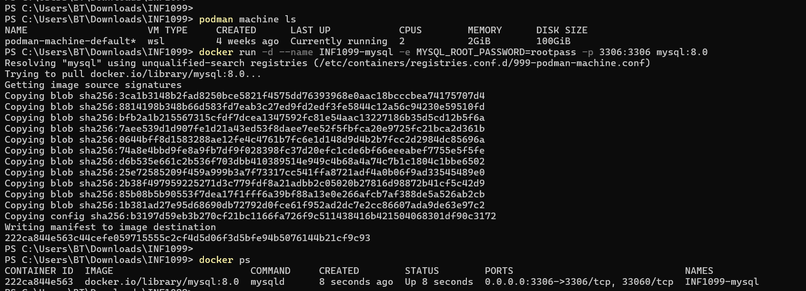
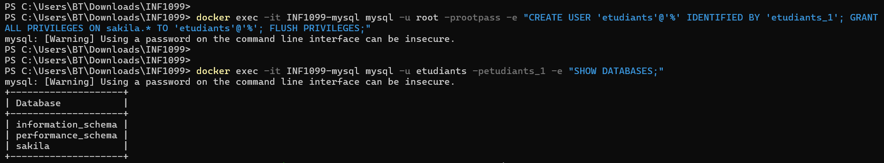
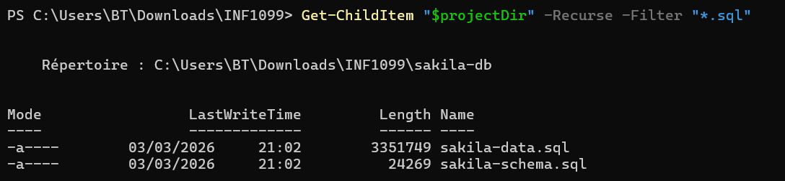
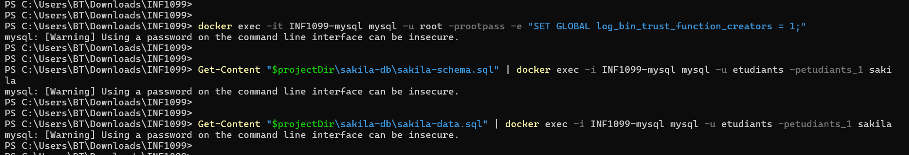
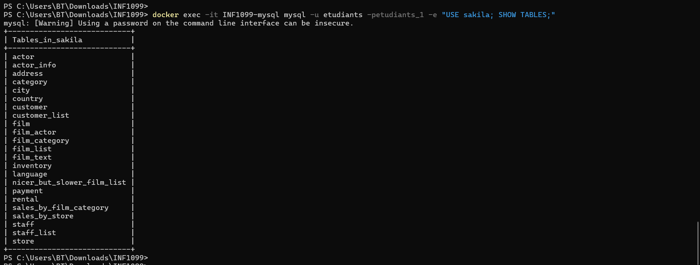
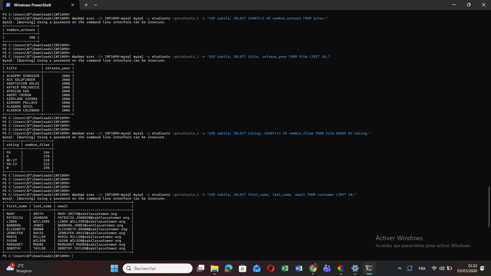

# TP INF1099 – Automatisation de la base Sakila avec Docker / Podman

**Nom :** Rahmani Chakib  
**Numéro étudiant :** 300150399  

---

# Objectif

Ce TP consiste à automatiser le déploiement de la base de données **Sakila** en utilisant **Docker (Podman)** et **MySQL 8**.

Les étapes incluent :

- lancement d’un conteneur MySQL
- création de la base Sakila
- création d’un utilisateur applicatif
- importation du schéma et des données
- vérification avec des requêtes SQL

---

# Environnement utilisé

- Windows  
- PowerShell  
- Podman (alias Docker)  
- MySQL 8  
- Base Sakila  

---

# Étape 1 – Vérification de Podman

Commande utilisée :

podman --version
Set-Alias docker podman

---

# Étape 2 – Création du dossier du projet

Commandes utilisées :

$projectDir = "$env:USERPROFILE\Downloads\INF1099"
New-Item -ItemType Directory -Force -Path $projectDir
Set-Location $projectDir
pwd

---

# Étape 3 – Initialisation de Podman

Commandes utilisées :

podman machine init
podman machine start

---

# Étape 4 – Lancement du conteneur MySQL

Commande utilisée :

docker run -d --name INF1099-mysql -e MYSQL_ROOT_PASSWORD=rootpass -p 3306:3306 mysql:8.0

Vérification :

docker ps

---

# Étape 5 – Création de la base de données Sakila

Commande :

docker exec -it INF1099-mysql mysql -u root -prootpass -e "CREATE DATABASE sakila;"

Vérification :

SHOW DATABASES;

---

# Étape 6 – Création de l’utilisateur etudiants

Commandes :

CREATE USER 'etudiants'@'%' IDENTIFIED BY 'etudiants_1';
GRANT ALL PRIVILEGES ON sakila.* TO 'etudiants'@'%';
FLUSH PRIVILEGES;

---

# Étape 7 – Vérification des fichiers Sakila

Commande utilisée :

Get-ChildItem "$projectDir" -Recurse -Filter "*.sql"

Les fichiers trouvés :

- sakila-schema.sql  
- sakila-data.sql  

---

# Étape 8 – Importation du schéma Sakila

Commande :

Get-Content "$projectDir\sakila-db\sakila-schema.sql" | docker exec -i INF1099-mysql mysql -u etudiants -petudiants_1 sakila

---

# Étape 9 – Importation des données Sakila

Commande :

Get-Content "$projectDir\sakila-db\sakila-data.sql" | docker exec -i INF1099-mysql mysql -u etudiants -petudiants_1 sakila

---

# Étape 10 – Vérification de la base

Commande utilisée :

docker exec -it INF1099-mysql mysql -u etudiants -petudiants_1 -e "USE sakila; SHOW TABLES;"

Exemples de requêtes SQL :

SELECT COUNT() FROM actor;
SELECT title, release_year FROM film LIMIT 10;
SELECT rating, COUNT() FROM film GROUP BY rating;
SELECT first_name, last_name, email FROM customer LIMIT 10;

---

# Conclusion

La base de données Sakila a été déployée avec succès dans un conteneur MySQL à l’aide de Podman.  
Les tables ont été créées et les données importées correctement, comme confirmé par les requêtes SQL exécutées.

Cette méthode permet de déployer rapidement une base de données dans un environnement conteneurisé et reproductible.