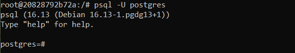
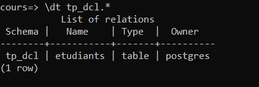
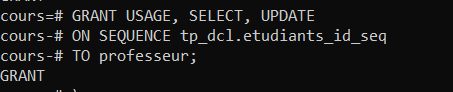
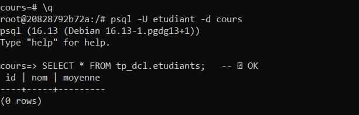
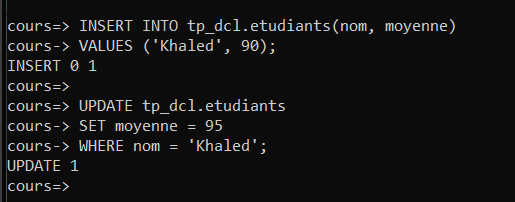
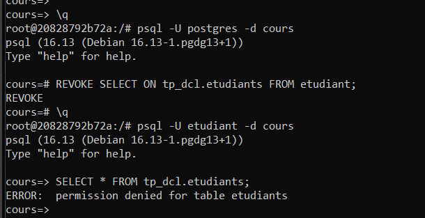
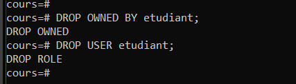

# 🔐 TP 4 — DCL : Data Control Language

> **Cours** : INF1099-201-26H-04 | **Technologie** : PostgreSQL  
> **Objectif** : Maîtriser la gestion des utilisateurs et des permissions dans une base de données relationnelle.

---

## 📚 Table des matières

1. [Qu'est-ce que le DCL ?](#-quest-ce-que-le-dcl-)
2. [Les commandes DCL principales](#-les-commandes-dcl-principales)
3. [DCL vs ACL](#-dcl-vs-acl)
4. [Prérequis](#-prérequis)
5. [Préparation de l'environnement](#-préparation-de-lenvironnement)
6. [Création des utilisateurs](#-création-des-utilisateurs)
7. [Attribution des droits (GRANT)](#-attribution-des-droits-grant)
8. [Vérification des permissions](#-vérification-des-permissions)
9. [Retrait des droits (REVOKE)](#-retrait-des-droits-revoke)
10. [Suppression des utilisateurs (DROP USER)](#-suppression-des-utilisateurs-drop-user)
11. [À retenir](#-à-retenir)

---

## 🧠 Qu'est-ce que le DCL ?

Le **DCL (Data Control Language)** est la partie du SQL dédiée au contrôle des droits et à la sécurité des données dans une base. En résumé : **DCL = qui peut faire quoi sur la base de données**.

En SQL, il existe plusieurs sous-langages selon le type d'action :

| Catégorie | But | Exemples |
|-----------|-----|----------|
| **DDL** – Data Definition Language | Définir/modifier la structure | `CREATE TABLE`, `ALTER TABLE`, `DROP TABLE` |
| **DML** – Data Manipulation Language | Manipuler les données | `INSERT`, `UPDATE`, `DELETE` |
| **DQL** – Data Query Language | Interroger / lire les données | `SELECT` |
| **DCL** – Data Control Language | Contrôler les droits | `GRANT`, `REVOKE`, `CREATE USER` |
| **TCL** – Transaction Control Language | Gérer les transactions | `COMMIT`, `ROLLBACK` |

---

## 🔑 Les commandes DCL principales

| Commande | Description |
|----------|-------------|
| `CREATE USER` | Créer un utilisateur |
| `DROP USER` | Supprimer un utilisateur |
| `GRANT` | Donner des droits (lecture, écriture…) |
| `REVOKE` | Retirer des droits |

**Exemple simple :**

```sql
CREATE USER etudiant WITH PASSWORD 'abc123';
GRANT SELECT ON table1 TO etudiant;
REVOKE SELECT ON table1 FROM etudiant;
DROP USER etudiant;
```

---

## ⚖️ DCL vs ACL

L'**ACL (Access Control List)** est un concept similaire au DCL, mais au niveau système/réseau/fichiers. Pour chaque ressource, une liste de contrôle indique qui peut y accéder et avec quels droits.

**Exemple classique Linux :**

```bash
ls -l fichier.txt
# -rw-r----- 1 alice staff 123 Feb 11 12:00 fichier.txt
# alice peut lire et écrire, le groupe staff peut lire, les autres n'ont aucun droit
```

| Aspect | DCL | ACL |
|--------|-----|-----|
| **Niveau** | Base de données | Système / fichiers / réseau |
| **Objectif** | Contrôler qui manipule les données (tables, vues…) | Contrôler qui accède à une ressource (fichier, répertoire…) |
| **Commandes** | `GRANT`, `REVOKE`, `CREATE USER` | `chmod`, `chown`, `setfacl`, ACL Windows |
| **Granularité** | Tables, schémas, colonnes | Fichiers, répertoires, services, ports… |
| **Exemple** | `GRANT SELECT ON table1 TO etudiant;` | `setfacl -m u:ubuntu:r fichier.txt` |

> 💡 **DCL** = droits dans la base de données | **ACL** = droits dans le système ou sur des ressources externes

---

## ✅ Prérequis

- PostgreSQL installé (via Docker ou natif)
- Accès à `psql` ou PgAdmin
- Une base de test : `cours`

---

## 🛠️ Préparation de l'environnement

### 1. Se connecter au conteneur Docker

```bash
docker container exec --interactive --tty postgres bash
```

### 2. Se connecter en tant que superutilisateur

```bash
psql -U postgres
```



### 3. Créer la base de test et le schéma

```sql
CREATE DATABASE cours;
\c cours
CREATE SCHEMA tp_dcl;
```

### 4. Créer la table pour les exercices

```sql
CREATE TABLE tp_dcl.etudiants (
    id      SERIAL PRIMARY KEY,
    nom     TEXT,
    moyenne NUMERIC
);
```

### 5. Vérifier la table créée

```sql
\dt tp_dcl.*
```



### 🎯 Rappel fondamental — Hiérarchie PostgreSQL

PostgreSQL fonctionne avec une hiérarchie stricte. Les droits sont liés à la base de données courante :

```
Cluster
├── Base 1 (postgres)
├── Base 2 (cours)
│   └── Schéma tp_dcl
│       └── Table etudiants
└── Base 3 (appdb)
```

> Un schéma appartient à une base. Une table appartient à un schéma.

---

## 👤 Création des utilisateurs

```sql
-- Étudiant simple (lecture seule)
CREATE USER etudiant WITH PASSWORD 'etudiant123';

-- Professeur (lecture + écriture)
CREATE USER professeur WITH PASSWORD 'prof123';
```

---

## 🎁 Attribution des droits (GRANT)

### 🔹 Connexion à la base

```sql
GRANT CONNECT ON DATABASE cours TO etudiant, professeur;
```

### 🔹 Accès au schéma

```sql
GRANT USAGE ON SCHEMA tp_dcl TO etudiant, professeur;
```

### 🔹 Droits sur la table

```sql
-- Étudiant : lecture seule
GRANT SELECT ON tp_dcl.etudiants TO etudiant;

-- Professeur : lecture + écriture complète
GRANT SELECT, INSERT, UPDATE, DELETE ON tp_dcl.etudiants TO professeur;
```

### 🔹 Droits sur la séquence (nécessaire pour INSERT avec SERIAL)

```sql
GRANT USAGE, SELECT, UPDATE ON SEQUENCE tp_dcl.etudiants_id_seq TO professeur;
```



---

## 🔍 Vérification des permissions

### ✅ Test avec l'utilisateur `etudiant` (lecture seule)

```bash
\q
psql -U etudiant -d cours
```

```sql
SELECT * FROM tp_dcl.etudiants;                                      -- ✅ OK
INSERT INTO tp_dcl.etudiants(nom, moyenne) VALUES ('Patrick', 85);   -- ❌ ERREUR
```



### ✅ Test avec l'utilisateur `professeur` (lecture + écriture)

```bash
psql -U professeur -d cours
```

```sql
INSERT INTO tp_dcl.etudiants(nom, moyenne) VALUES ('Khaled', 90);    -- ✅ OK
UPDATE tp_dcl.etudiants SET moyenne = 95 WHERE nom = 'Khaled';       -- ✅ OK
```



---

## 🚫 Retrait des droits (REVOKE)

Se reconnecter en tant que superutilisateur pour révoquer les droits :

```bash
psql -U postgres -d cours
```

```sql
REVOKE SELECT ON tp_dcl.etudiants FROM etudiant;
```

Puis retester avec l'étudiant :

```bash
psql -U etudiant -d cours
```

```sql
SELECT * FROM tp_dcl.etudiants;
-- ❌ ERROR: permission denied for table etudiants
```



---

## 🗑️ Suppression des utilisateurs (DROP USER)

```sql
DROP OWNED BY etudiant;
DROP USER etudiant;
```



> ⚠️ **Attention** : PostgreSQL ne permet pas de supprimer un utilisateur si celui-ci possède encore des objets (tables, schémas). Il faut d'abord exécuter `DROP OWNED BY` pour libérer ses objets avant de pouvoir faire `DROP USER`.

---

## 🧠 À retenir

### 1. DCL = Data Control Language
- `GRANT` / `REVOKE` → gérer les permissions
- `CREATE USER` / `DROP USER` → gérer les utilisateurs

### 2. PostgreSQL sépare les niveaux de droits

| Niveau | Commande |
|--------|----------|
| **Base de données** | `GRANT CONNECT ON DATABASE` |
| **Schéma** | `GRANT USAGE ON SCHEMA` |
| **Table** | `GRANT SELECT, INSERT, UPDATE, DELETE ON TABLE` |
| **Séquence** | `GRANT USAGE, SELECT, UPDATE ON SEQUENCE` |

### 3. Les rôles
Les rôles permettent de regrouper les permissions et simplifient la gestion de nombreux utilisateurs.

---

> 📌 *TP réalisé dans le cadre du cours INF1099-201-26H-04 — CollegeBoreal*
