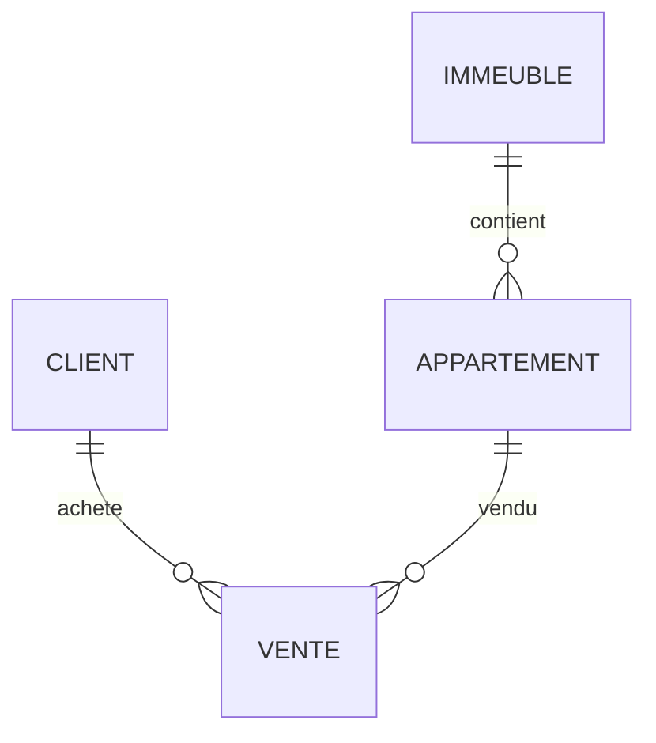

<div align="center">

# 🏢 TP Modélisation SQL

## Gestion des ventes d’appartements


</div>

---

## 📚 Table des matières

* 🎯 Aperçu du projet
* 📁 Structure du projet
* 🔄 Normalisation
* 📊 Diagramme ER
* 🧠 Démarche de conception
* 🏗️ DDL — Définition des structures
* 📝 DML — Manipulation des données
* 🔍 Requêtes SQL (SELECT / JOIN)
* ⚡ Optimisation
* 📸 Captures
* ✅ Conclusion

---

## 🎯 Aperçu du projet

Ce projet consiste à concevoir une **base de données relationnelle** pour la gestion des ventes d’appartements dans des immeubles.

Il permet de représenter :

* les clients
* les immeubles
* les appartements
* les ventes

### 🎯 Objectifs

* Appliquer la **normalisation (1FN → 3FN)**
* Concevoir un modèle propre et efficace
* Éviter la redondance
* Assurer l’intégrité des données

---

## 📁 Structure du projet

```
300150271/
├── README.md
├── ddl.sql
├── dml.sql
└── images/
```

---

## 🔄 Normalisation

### 1️⃣ Première Forme Normale (1FN)

Toutes les données sont regroupées dans une seule table :

```
VENTE(IdVente, NomClient, TelClient, AdresseImmeuble, Ville, NumAppartement, Surface, Prix, DateVente)
```

### ❌ Problèmes

* Redondance des données
* Difficulté de mise à jour
* Risque d’incohérence
* Anomalies d’insertion et suppression

---

### 2️⃣ Deuxième Forme Normale (2FN)

Séparation des entités pour éliminer les dépendances partielles :

* CLIENT
* IMMEUBLE
* APPARTEMENT
* VENTE

---

### 3️⃣ Troisième Forme Normale (3FN)

Structure finale optimisée :

| Table       | Attributs                                                   |
| ----------- | ----------------------------------------------------------- |
| CLIENT      | IdClient 🔑, Nom, Telephone                                 |
| IMMEUBLE    | IdImmeuble 🔑, Adresse, Ville                               |
| APPARTEMENT | IdAppartement 🔑, NumAppartement, Surface, Prix, IdImmeuble |
| VENTE       | IdVente 🔑, DateVente, IdClient, IdAppartement              |

### ✅ Avantages

* Aucune redondance
* Meilleure performance
* Données cohérentes
* Maintenance facile

---

## 📊 Diagramme ER



---

## 🧠 Démarche de conception

### 1. Analyse des besoins

* Identifier les acteurs (clients)
* Identifier les objets (appartements, immeubles)
* Définir les relations

---

### 2. Modélisation conceptuelle

* Diagramme ER
* Définition des entités et attributs

---

### 3. Modélisation logique

* Transformation en tables
* Définition des clés primaires
* Définition des clés étrangères

---

### 4. Implémentation

* Création des tables
* Insertion des données
* Test des requêtes

---

## 🏗️ DDL — Définition des structures

```sql
CREATE TABLE Client (
IdClient SERIAL PRIMARY KEY,
Nom TEXT NOT NULL,
Telephone TEXT
);

CREATE TABLE Immeuble (
IdImmeuble SERIAL PRIMARY KEY,
Adresse TEXT NOT NULL,
Ville TEXT NOT NULL
);

CREATE TABLE Appartement (
IdAppartement SERIAL PRIMARY KEY,
NumAppartement INT,
Surface FLOAT,
Prix FLOAT,
IdImmeuble INT REFERENCES Immeuble(IdImmeuble)
);

CREATE TABLE Vente (
IdVente SERIAL PRIMARY KEY,
DateVente DATE,
IdClient INT REFERENCES Client(IdClient),
IdAppartement INT REFERENCES Appartement(IdAppartement)
);
```

---

## 📝 DML — Manipulation des données

```sql
INSERT INTO Client VALUES (DEFAULT,'Ali','514000000');
INSERT INTO Client VALUES (DEFAULT,'Sara','438000000');

INSERT INTO Immeuble VALUES (DEFAULT,'Rue A','Montreal');
INSERT INTO Immeuble VALUES (DEFAULT,'Rue B','Quebec');

INSERT INTO Appartement VALUES (DEFAULT,101,75,250000,1);
INSERT INTO Appartement VALUES (DEFAULT,202,90,320000,2);

INSERT INTO Vente VALUES (DEFAULT,'2024-01-10',1,1);
INSERT INTO Vente VALUES (DEFAULT,'2024-02-15',2,2);
```

---

## 🔍 Requêtes SQL

### 📌 SELECT simple

```sql
SELECT * FROM Client;
```

---

### 📌 Jointure (JOIN)

```sql
SELECT 
    c.Nom,
    a.NumAppartement,
    v.DateVente
FROM Vente v
JOIN Client c ON v.IdClient = c.IdClient
JOIN Appartement a ON v.IdAppartement = a.IdAppartement;
```

---

## ⚡ Optimisation

Techniques utilisées :

* Clés primaires (index automatique)
* Clés étrangères (intégrité référentielle)
* Normalisation (réduction des duplications)

### 🎯 Résultat

* Base rapide
* Données fiables
* Structure évolutive

---

## 📸 Captures

### ✔️ À ajouter

* 📂 Structure du dossier
* 🧾 ddl.sql ouvert
* 🧾 dml.sql ouvert
* 🧠 Diagramme ER
* 💻 Résultat SELECT
* 🔗 Page GitHub

---

## ✅ Conclusion

Ce projet m’a permis de :

* Comprendre la normalisation des bases de données
* Concevoir un modèle relationnel structuré
* Appliquer SQL (DDL & DML)
* Optimiser une base de données

👉 Ce travail représente une base solide pour des projets plus complexes en bases de données.

---
