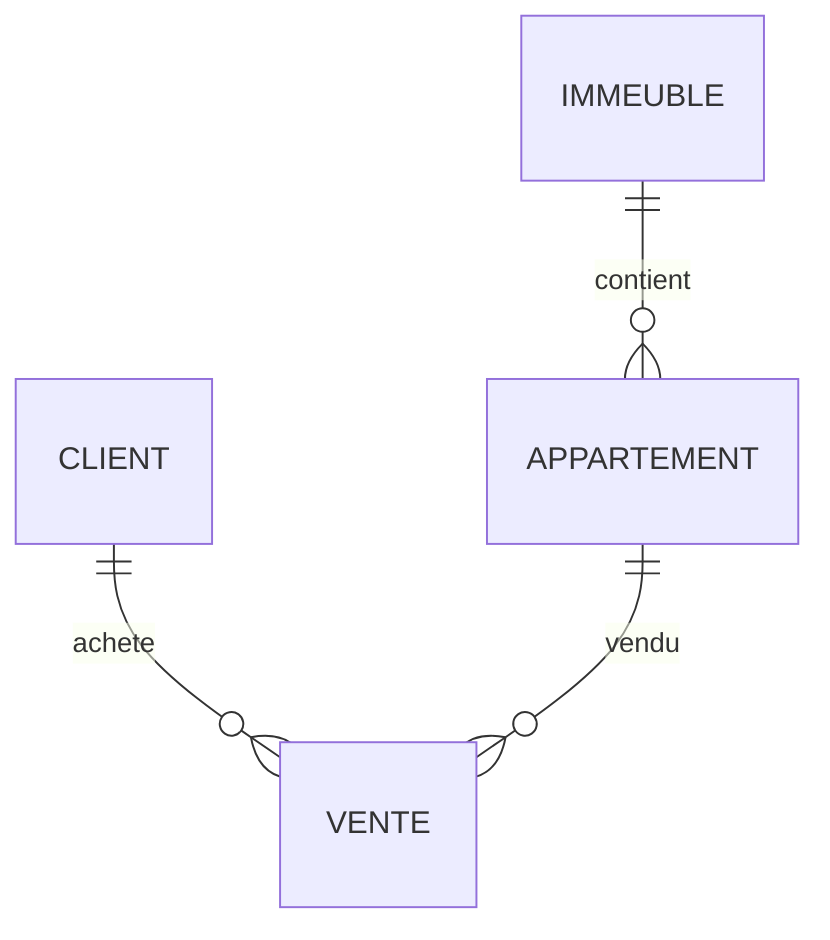

<div align="center">

# 🏢 TP Modélisation SQL

## Système de gestion des ventes d’appartements


</div>

---

## 📚 Table des matières

* [🎯 Aperçu du projet](#-aperçu-du-projet)
* [📁 Structure du projet](#-structure-du-projet)
* [🔄 Normalisation](#-normalisation)
* [📊 Diagramme ER](#-diagramme-er)
* [🏗️ DDL — Définition des structures](#️-ddl--définition-des-structures)
* [📝 DML — Manipulation des données](#-dml--manipulation-des-données)
* [🔐 DCL — Contrôle des accès](#-dcl--contrôle-des-accès)
* [⚡ Optimisation](#-optimisation)
* [✅ Conclusion](#-conclusion)

---

## 🎯 Aperçu du projet

Ce projet consiste à concevoir une base de données pour gérer les ventes d’appartements dans des immeubles.

Objectifs :

* Modéliser les données
* Appliquer la normalisation
* Créer une base relationnelle
* Manipuler les données avec SQL

---

## 📁 Structure du projet

```
300150271/
├── README.md
├── ddl.sql
├── dml.sql
└── images/
```

---

## 🔄 Normalisation

### 🔹 1FN — Première Forme Normale

Toutes les données sont stockées dans une seule table :

```
VENTE(IdVente, NomClient, TelClient, AdresseImmeuble, Ville, NumAppartement, Surface, Prix, DateVente)
```

❌ Problèmes :

* Redondance
* Difficulté de mise à jour
* Anomalies

---

### 🔹 2FN — Deuxième Forme Normale

Séparation en entités :

* CLIENT
* IMMEUBLE
* APPARTEMENT
* VENTE

✔️ Suppression des dépendances partielles

---

### 🔹 3FN — Troisième Forme Normale

Structure finale :

| Table       | Attributs                                                |
| ----------- | -------------------------------------------------------- |
| CLIENT      | IdClient, Nom, Telephone                                 |
| IMMEUBLE    | IdImmeuble, Adresse, Ville                               |
| APPARTEMENT | IdAppartement, NumAppartement, Surface, Prix, IdImmeuble |
| VENTE       | IdVente, DateVente, IdClient, IdAppartement              |

---

## 📊 Diagramme ER



---

## 🏗️ DDL — Définition des structures

```sql
CREATE TABLE Client (
IdClient SERIAL PRIMARY KEY,
Nom TEXT,
Telephone TEXT
);

CREATE TABLE Immeuble (
IdImmeuble SERIAL PRIMARY KEY,
Adresse TEXT,
Ville TEXT
);

CREATE TABLE Appartement (
IdAppartement SERIAL PRIMARY KEY,
NumAppartement INT,
Surface FLOAT,
Prix FLOAT,
IdImmeuble INT REFERENCES Immeuble(IdImmeuble)
);

CREATE TABLE Vente (
IdVente SERIAL PRIMARY KEY,
DateVente DATE,
IdClient INT REFERENCES Client(IdClient),
IdAppartement INT REFERENCES Appartement(IdAppartement)
);
```

---

## 📝 DML — Manipulation des données

```sql
INSERT INTO Client VALUES (DEFAULT,'Ali','514000000');
INSERT INTO Client VALUES (DEFAULT,'Sara','438000000');

INSERT INTO Immeuble VALUES (DEFAULT,'Rue A','Montreal');
INSERT INTO Immeuble VALUES (DEFAULT,'Rue B','Quebec');

INSERT INTO Appartement VALUES (DEFAULT,101,75,250000,1);
INSERT INTO Appartement VALUES (DEFAULT,202,90,320000,2);

INSERT INTO Vente VALUES (DEFAULT,'2024-01-10',1,1);
INSERT INTO Vente VALUES (DEFAULT,'2024-02-15',2,2);
```

---

## 🔐 DCL — Contrôle des accès

```sql
CREATE USER agent WITH PASSWORD '1234';
GRANT SELECT ON ALL TABLES IN SCHEMA public TO agent;
```

---

## ⚡ Optimisation

Techniques utilisées :

* Index sur clés étrangères
* Requêtes optimisées
* Éviter SELECT *
* Structure normalisée

---

## ✅ Conclusion

Ce projet m’a permis de :

* Comprendre la normalisation (1FN → 3FN)
* Concevoir une base relationnelle
* Utiliser SQL efficacement
* Structurer un projet professionnel

---

## 👨‍🎓 Auteur

Mazigh Bareche
Projet académique – Base de données
