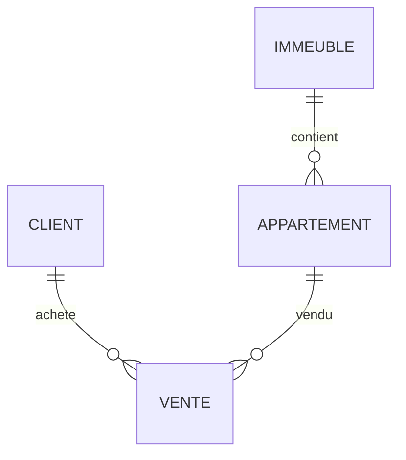

\# 🏢 TP Modélisation SQL

\## Gestion des ventes d’appartements

\*\*Nom : Mazigh Bareche\*\*

\*\*Code étudiant : 300150271\*\*

\---

\## 🎯 Aperçu

Ce projet modélise un système de vente d’appartements dans des immeubles.

\---

\## 🔄 Normalisation

\### 1FN

Toutes les données dans une seule table VENTE → redondance

\### 2FN

Séparation :

\* Client

\* Immeuble

\* Appartement

\* Vente

\### 3FN

Structure finale :

\* CLIENT(IdClient, Nom, Telephone)

\* IMMEUBLE(IdImmeuble, Adresse, Ville)

\* APPARTEMENT(IdAppartement, NumAppartement, Surface, Prix, IdImmeuble)

\* VENTE(IdVente, DateVente, IdClient, IdAppartement)

\---

\## 📊 Diagramme ER

\---

\## 🏗️ DDL

Voir fichier ddl.sql

\---

\## 📝 DML

Voir fichier dml.sql

\---

\## ✅ Conclusion

Ce TP m’a permis de comprendre la normalisation et la conception d’une base de données relationnelle.

