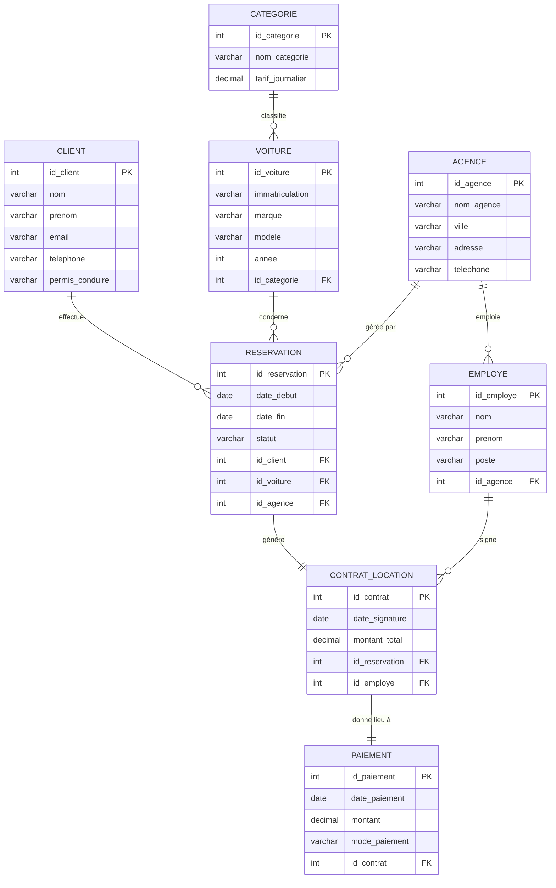
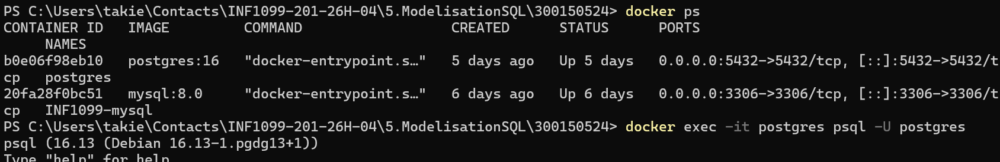
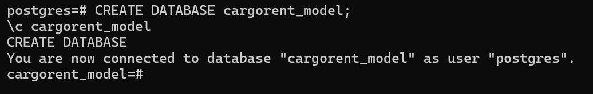
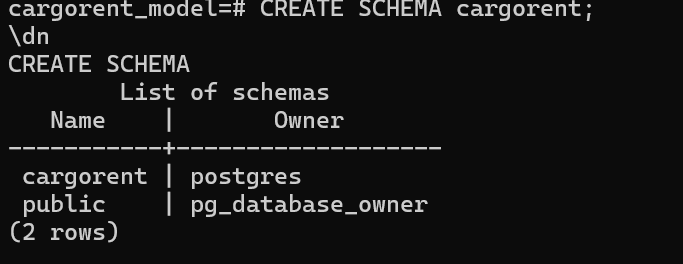
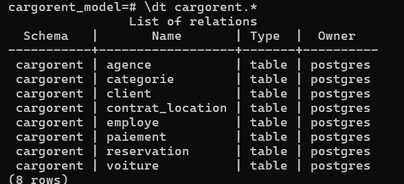
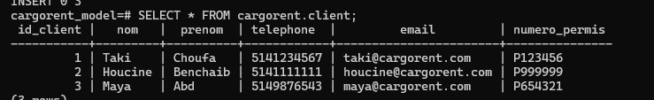
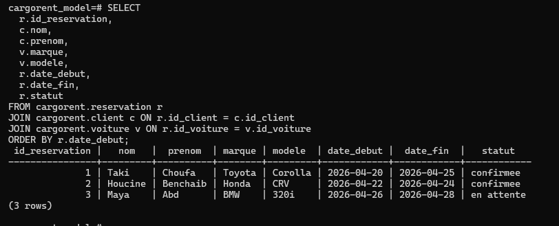
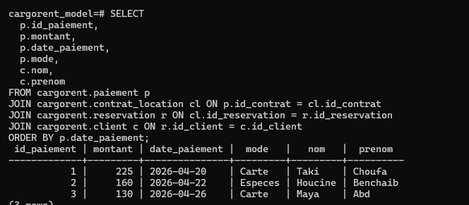
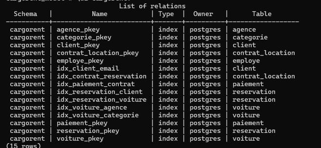
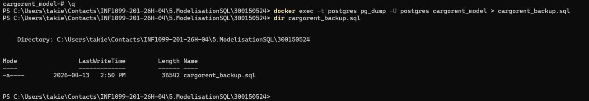

# 🚗 CarGoRent — Modélisation et Implémentation d'une Base de Données
### Projet académique — Conception, normalisation et déploiement PostgreSQL

---

<div align="center">


</div>

---

## 📋 Informations du Projet

| Champ | Détail |
|---|---|
| 👤 **Étudiant** | Taki Eddine Choufa |
| 🆔 **Numéro étudiant** | 300150524 |
| 📚 **Cours** | INF1099 — Conception et déploiement de bases de données |
| 🗂️ **Projet** | Modélisation et implémentation d'une base de données |
| 🏢 **Domaine** | CarGoRent — Location de voitures |
| 🐘 **SGBD** | PostgreSQL 16 |

---

## 🎯 Objectifs du Projet

Ce projet couvre le cycle complet de vie d'une base de données relationnelle : de l'analyse du domaine métier jusqu'au déploiement et à la sauvegarde en production. Les compétences visées sont les suivantes :

- 🔍 Analyser un domaine réel et identifier ses entités métier
- 📐 Construire un modèle conceptuel Entité-Association (EA)
- 🔄 Transformer le modèle conceptuel en modèle logique relationnel
- 📏 Normaliser la structure en **Troisième Forme Normale (3FN)**
- 🐘 Implémenter la base de données avec **PostgreSQL 16** sous Docker
- 📥 Insérer des données et les interroger avec des requêtes **JOIN**
- ⚡ Optimiser les performances avec des **index**
- 💾 Sauvegarder la base avec **pg_dump**

---

## 1️⃣ Analyse du Domaine

### 🏢 Présentation de CarGoRent

**CarGoRent** est une entreprise de location de voitures opérant à travers plusieurs agences. Le système gère l'ensemble du cycle de location : de l'inscription du client à la signature du contrat, en passant par la gestion du parc automobile, les réservations et les paiements.

Le système doit permettre de :
- Gérer les clients et leur historique de locations
- Administrer le parc de véhicules par catégorie
- Coordonner les réservations entre les agences
- Formaliser les contrats de location
- Tracer les paiements associés
- Gérer les employés affectés aux agences

---

### 🧩 Entités Identifiées

| Entité | Rôle dans le système |
|---|---|
| `Client` | Personne physique qui effectue une réservation |
| `Voiture` | Véhicule disponible à la location |
| `Categorie` | Classification des voitures (économique, SUV, luxe…) |
| `Agence` | Point de service CarGoRent (ville, adresse) |
| `Reservation` | Demande de location formulée par un client |
| `Contrat_Location` | Document officiel liant client, voiture et agence |
| `Paiement` | Transaction financière associée à un contrat |
| `Employe` | Membre du personnel rattaché à une agence |

---

## 2️⃣ Modèle Conceptuel (Entité-Association)

### 📐 Description des Relations

Les entités sont reliées entre elles selon les règles métier suivantes :

- Un **Client** peut effectuer plusieurs **Réservations** (1,N)
- Une **Réservation** concerne exactement une **Voiture** et une **Agence** (N,1)
- Un **Contrat_Location** est généré à partir d'une **Réservation** confirmée (1,1)
- Un **Paiement** est associé à un seul **Contrat_Location** (1,1)
- Une **Voiture** appartient à une **Categorie** (N,1)
- Un **Employé** est rattaché à une **Agence** (N,1)

---

### 🗺️ Diagramme Entité-Association (ERD)



---

## 3️⃣ Modèle Logique

Le modèle logique traduit le schéma conceptuel en tables relationnelles avec identification explicite des **clés primaires (PK)** et **clés étrangères (FK)**.

### 📊 Tables et Relations

| Table | Clé Primaire | Clés Étrangères |
|---|---|---|
| `Client` | `id_client` | — |
| `Categorie` | `id_categorie` | — |
| `Voiture` | `id_voiture` | `id_categorie → Categorie` |
| `Agence` | `id_agence` | — |
| `Employe` | `id_employe` | `id_agence → Agence` |
| `Reservation` | `id_reservation` | `id_client → Client`, `id_voiture → Voiture`, `id_agence → Agence` |
| `Contrat_Location` | `id_contrat` | `id_reservation → Reservation`, `id_employe → Employe` |
| `Paiement` | `id_paiement` | `id_contrat → Contrat_Location` |

---

## 4️⃣ Modèle Relationnel (3FN)

La structure est normalisée jusqu'en **Troisième Forme Normale (3FN)** : chaque attribut non-clé dépend uniquement de la clé primaire, sans dépendances transitives.

> **Convention** : `PK` = clé primaire · `#` = clé étrangère

```
CLIENT (id_client PK, nom, prenom, email, telephone, permis_conduire)

CATEGORIE (id_categorie PK, nom_categorie, tarif_journalier)

VOITURE (id_voiture PK, immatriculation, marque, modele, annee,
         #id_categorie → CATEGORIE)

AGENCE (id_agence PK, nom_agence, ville, adresse, telephone)

EMPLOYE (id_employe PK, nom, prenom, poste,
         #id_agence → AGENCE)

RESERVATION (id_reservation PK, date_debut, date_fin, statut,
             #id_client  → CLIENT,
             #id_voiture → VOITURE,
             #id_agence  → AGENCE)

CONTRAT_LOCATION (id_contrat PK, date_signature, montant_total,
                  #id_reservation → RESERVATION,
                  #id_employe     → EMPLOYE)

PAIEMENT (id_paiement PK, date_paiement, montant, mode_paiement,
          #id_contrat → CONTRAT_LOCATION)
```

**Justification de la 3FN :**
- Chaque table possède une clé primaire atomique
- Aucun attribut non-clé ne dépend d'un autre attribut non-clé
- Les informations des catégories sont isolées de la table `Voiture` pour éliminer les redondances
- Les données d'agence ne sont pas dupliquées dans `Employe` ni dans `Reservation`

---

## 5️⃣ Implémentation PostgreSQL

### 🔌 Connexion au Conteneur Docker

La première étape est d'accéder à l'instance PostgreSQL tournant dans le conteneur Docker.

```powershell
docker exec -it <nom_du_conteneur> psql -U postgres
```



---

### 🗄️ Création de la Base de Données

```sql
CREATE DATABASE cargorent_model;
\c cargorent_model
```



---

### 📁 Création du Schéma

```sql
CREATE SCHEMA cargorent;
```

Le schéma `cargorent` isole tous les objets du projet dans un espace de noms dédié, ce qui est une bonne pratique en environnement multi-projets.



---

### 🏗️ Création des Tables

```sql
-- Table des catégories de véhicules
CREATE TABLE cargorent.categorie (
    id_categorie     SERIAL PRIMARY KEY,
    nom_categorie    VARCHAR(50)   NOT NULL,
    tarif_journalier DECIMAL(8,2) NOT NULL
);

-- Table des clients
CREATE TABLE cargorent.client (
    id_client       SERIAL PRIMARY KEY,
    nom             VARCHAR(100)  NOT NULL,
    prenom          VARCHAR(100)  NOT NULL,
    email           VARCHAR(150)  UNIQUE NOT NULL,
    telephone       VARCHAR(20),
    permis_conduire VARCHAR(50)   UNIQUE NOT NULL
);

-- Table des voitures
CREATE TABLE cargorent.voiture (
    id_voiture      SERIAL PRIMARY KEY,
    immatriculation VARCHAR(20)  UNIQUE NOT NULL,
    marque          VARCHAR(50)  NOT NULL,
    modele          VARCHAR(50)  NOT NULL,
    annee           INT,
    id_categorie    INT          NOT NULL,
    FOREIGN KEY (id_categorie) REFERENCES cargorent.categorie(id_categorie)
);

-- Table des agences
CREATE TABLE cargorent.agence (
    id_agence  SERIAL PRIMARY KEY,
    nom_agence VARCHAR(100) NOT NULL,
    ville      VARCHAR(100) NOT NULL,
    adresse    VARCHAR(200),
    telephone  VARCHAR(20)
);

-- Table des employés
CREATE TABLE cargorent.employe (
    id_employe SERIAL PRIMARY KEY,
    nom        VARCHAR(100) NOT NULL,
    prenom     VARCHAR(100) NOT NULL,
    poste      VARCHAR(100),
    id_agence  INT          NOT NULL,
    FOREIGN KEY (id_agence) REFERENCES cargorent.agence(id_agence)
);

-- Table des réservations
CREATE TABLE cargorent.reservation (
    id_reservation SERIAL PRIMARY KEY,
    date_debut     DATE         NOT NULL,
    date_fin       DATE         NOT NULL,
    statut         VARCHAR(30)  DEFAULT 'en attente',
    id_client      INT          NOT NULL,
    id_voiture     INT          NOT NULL,
    id_agence      INT          NOT NULL,
    FOREIGN KEY (id_client)  REFERENCES cargorent.client(id_client),
    FOREIGN KEY (id_voiture) REFERENCES cargorent.voiture(id_voiture),
    FOREIGN KEY (id_agence)  REFERENCES cargorent.agence(id_agence)
);

-- Table des contrats de location
CREATE TABLE cargorent.contrat_location (
    id_contrat     SERIAL PRIMARY KEY,
    date_signature DATE           NOT NULL,
    montant_total  DECIMAL(10,2)  NOT NULL,
    id_reservation INT            UNIQUE NOT NULL,
    id_employe     INT            NOT NULL,
    FOREIGN KEY (id_reservation) REFERENCES cargorent.reservation(id_reservation),
    FOREIGN KEY (id_employe)     REFERENCES cargorent.employe(id_employe)
);

-- Table des paiements
CREATE TABLE cargorent.paiement (
    id_paiement   SERIAL PRIMARY KEY,
    date_paiement DATE           NOT NULL,
    montant       DECIMAL(10,2)  NOT NULL,
    mode_paiement VARCHAR(50)    NOT NULL,
    id_contrat    INT            UNIQUE NOT NULL,
    FOREIGN KEY (id_contrat) REFERENCES cargorent.contrat_location(id_contrat)
);
```



---

## 6️⃣ Insertion des Données

Les données de test sont représentatives d'un scénario réaliste de l'entreprise CarGoRent.

```sql
-- Catégories
INSERT INTO cargorent.categorie (nom_categorie, tarif_journalier) VALUES
    ('Économique',    45.00),
    ('Intermédiaire', 65.00),
    ('SUV',           95.00),
    ('Luxe',         150.00);

-- Clients
INSERT INTO cargorent.client (nom, prenom, email, telephone, permis_conduire) VALUES
    ('Choufa',   'Taki Eddine', 'taki@cargorent.com',  '514-000-0001', 'PC-100001'),
    ('Martin',   'Lidia',       'lidia@cargorent.com', '514-000-0002', 'PC-100002'),
    ('Tremblay', 'Marc',        'marc@cargorent.com',  '514-000-0003', 'PC-100003');

-- Voitures
INSERT INTO cargorent.voiture (immatriculation, marque, modele, annee, id_categorie) VALUES
    ('QC-1001-AA', 'Toyota',  'Corolla', 2022, 1),
    ('QC-1002-BB', 'Honda',   'CR-V',    2023, 3),
    ('QC-1003-CC', 'BMW',     'Série 5', 2023, 4),
    ('QC-1004-DD', 'Hyundai', 'Elantra', 2021, 2);

-- Agences
INSERT INTO cargorent.agence (nom_agence, ville, adresse, telephone) VALUES
    ('CarGoRent Montréal', 'Montréal', '100 Rue Sainte-Catherine',      '514-100-0001'),
    ('CarGoRent Québec',   'Québec',   '200 Grande Allée',              '418-100-0002'),
    ('CarGoRent Laval',    'Laval',    '300 Boulevard de la Concorde',  '450-100-0003');

-- Employés
INSERT INTO cargorent.employe (nom, prenom, poste, id_agence) VALUES
    ('Dupont',  'Jean',  'Responsable agence',  1),
    ('Leblanc', 'Sarah', 'Conseiller location', 1),
    ('Gagnon',  'Pierre','Responsable agence',  2);

-- Réservations
INSERT INTO cargorent.reservation (date_debut, date_fin, statut, id_client, id_voiture, id_agence) VALUES
    ('2024-06-01', '2024-06-05', 'confirmée', 1, 1, 1),
    ('2024-06-10', '2024-06-15', 'confirmée', 2, 2, 1),
    ('2024-07-01', '2024-07-03', 'confirmée', 3, 4, 2);

-- Contrats de location
INSERT INTO cargorent.contrat_location (date_signature, montant_total, id_reservation, id_employe) VALUES
    ('2024-06-01', 180.00, 1, 1),
    ('2024-06-10', 475.00, 2, 2),
    ('2024-07-01', 130.00, 3, 3);

-- Paiements
INSERT INTO cargorent.paiement (date_paiement, montant, mode_paiement, id_contrat) VALUES
    ('2024-06-01', 180.00, 'Carte de crédit',   1),
    ('2024-06-10', 475.00, 'Virement bancaire', 2),
    ('2024-07-01', 130.00, 'Carte de débit',    3);
```

**Vérification des données clients :**

```sql
SELECT * FROM cargorent.client;
```



---

## 7️⃣ Requêtes SQL avec JOIN

### 🔗 Requête 1 — Réservations Détaillées

Cette requête restitue une vue complète de chaque réservation en croisant les informations du client, du véhicule, de la catégorie et de l'agence concernée.

```sql
SELECT
    r.id_reservation,
    c.nom   || ' ' || c.prenom     AS client,
    v.marque || ' ' || v.modele    AS vehicule,
    cat.nom_categorie,
    cat.tarif_journalier,
    a.nom_agence,
    a.ville,
    r.date_debut,
    r.date_fin,
    (r.date_fin - r.date_debut)    AS nb_jours,
    r.statut
FROM cargorent.reservation r
JOIN cargorent.client    c   ON r.id_client    = c.id_client
JOIN cargorent.voiture   v   ON r.id_voiture   = v.id_voiture
JOIN cargorent.categorie cat ON v.id_categorie = cat.id_categorie
JOIN cargorent.agence    a   ON r.id_agence    = a.id_agence
ORDER BY r.date_debut;
```



---

### 💳 Requête 2 — Paiements Détaillés

Cette requête présente un rapport financier complet en associant chaque paiement au contrat, à la réservation et au client correspondant.

```sql
SELECT
    p.id_paiement,
    c.nom   || ' ' || c.prenom  AS client,
    cl.date_signature,
    cl.montant_total,
    p.montant                   AS montant_payé,
    p.mode_paiement,
    p.date_paiement
FROM cargorent.paiement          p
JOIN cargorent.contrat_location  cl ON p.id_contrat      = cl.id_contrat
JOIN cargorent.reservation       r  ON cl.id_reservation = r.id_reservation
JOIN cargorent.client            c  ON r.id_client       = c.id_client
ORDER BY p.date_paiement;
```



---

## 8️⃣ Optimisation — Création d'Index

Les index améliorent significativement les performances des requêtes sur les colonnes fréquemment utilisées dans les clauses `WHERE`, `JOIN` et `ORDER BY`.

```sql
-- Index sur les clés étrangères les plus sollicitées
CREATE INDEX idx_voiture_categorie    ON cargorent.voiture(id_categorie);
CREATE INDEX idx_employe_agence       ON cargorent.employe(id_agence);
CREATE INDEX idx_reservation_client   ON cargorent.reservation(id_client);
CREATE INDEX idx_reservation_voiture  ON cargorent.reservation(id_voiture);
CREATE INDEX idx_reservation_agence   ON cargorent.reservation(id_agence);
CREATE INDEX idx_contrat_reservation  ON cargorent.contrat_location(id_reservation);
CREATE INDEX idx_paiement_contrat     ON cargorent.paiement(id_contrat);

-- Index sur colonnes de recherche métier fréquentes
CREATE INDEX idx_client_email             ON cargorent.client(email);
CREATE INDEX idx_voiture_immatriculation  ON cargorent.voiture(immatriculation);
CREATE INDEX idx_reservation_dates        ON cargorent.reservation(date_debut, date_fin);
```

**Vérification des index créés :**

```sql
\di cargorent.*
```



---

### 📊 Justification des Index

| Index | Colonne(s) | Justification |
|---|---|---|
| `idx_reservation_client` | `id_client` | Recherche de l'historique d'un client |
| `idx_reservation_dates` | `date_debut, date_fin` | Filtrage par période de location |
| `idx_client_email` | `email` | Authentification et recherche rapide |
| `idx_voiture_immatriculation` | `immatriculation` | Identification unique d'un véhicule |
| `idx_paiement_contrat` | `id_contrat` | Jointure entre contrat et paiement |

---

## 9️⃣ Sauvegarde de la Base de Données

### 💾 Export avec `pg_dump`

La sauvegarde est effectuée depuis l'hôte Windows en exécutant `pg_dump` à l'intérieur du conteneur Docker, puis en exportant le fichier vers le système local.

```powershell
# Sauvegarde complète (structure + données)
docker exec <nom_du_conteneur> pg_dump -U postgres -d cargorent_model > cargorent_backup.sql

# Vérification du fichier généré
Get-Item .\cargorent_backup.sql
Get-Content .\cargorent_backup.sql | Select-Object -First 20
```

**Options avancées de sauvegarde :**

```powershell
# Sauvegarde en format compressé (.dump)
docker exec <nom_du_conteneur> pg_dump -U postgres -d cargorent_model -F c -f /tmp/cargorent_backup.dump
docker cp <nom_du_conteneur>:/tmp/cargorent_backup.dump ./cargorent_backup.dump

# Sauvegarde du schéma uniquement (sans données)
docker exec <nom_du_conteneur> pg_dump -U postgres -d cargorent_model --schema-only > cargorent_schema.sql
```



**Restauration (référence future) :**

```powershell
# Restaurer depuis le fichier SQL
docker exec -i <nom_du_conteneur> psql -U postgres -d cargorent_model < cargorent_backup.sql
```

---

## 🔟 Conclusion

### 📝 Résumé du Projet

Ce projet a couvert l'intégralité du cycle de conception et de déploiement d'une base de données relationnelle pour le domaine de la location de voitures (**CarGoRent**). Partant d'une analyse du domaine métier, nous avons progressivement élaboré un modèle conceptuel, un modèle logique, puis un modèle physique normalisé en 3FN, avant de l'implémenter et de l'exploiter dans un environnement PostgreSQL conteneurisé avec Docker.

---

### 🏆 Compétences Acquises

| Domaine | Compétence |
|---|---|
| 📐 **Modélisation** | Conception d'un diagramme EA et traduction en modèle relationnel 3FN |
| 🗄️ **PostgreSQL** | Création de bases, schémas et tables avec contraintes d'intégrité |
| 🔗 **SQL avancé** | Requêtes multi-tables avec `JOIN`, calcul de colonnes dérivées |
| ⚡ **Optimisation** | Création et justification d'index sur colonnes stratégiques |
| 🐳 **Docker** | Déploiement et administration d'une instance PostgreSQL conteneurisée |
| 💾 **Sauvegarde** | Export et restauration via `pg_dump` depuis un environnement Docker |
| 🔒 **Normalisation** | Application rigoureuse de la 3FN pour éliminer les redondances |

---

### 🔮 Pistes d'Amélioration

- Ajouter des **vues** (`VIEW`) pour simplifier les rapports récurrents
- Mettre en place des **triggers** pour automatiser le calcul du `montant_total` selon les dates de réservation
- Implémenter des **procédures stockées** pour gérer les annulations de réservations
- Configurer la **réplication** PostgreSQL pour la haute disponibilité
- Intégrer des **contraintes CHECK** (ex. : `date_fin > date_debut`)

---

## 📁 Structure du Dépôt

```
cargorent-db/
├── README.md                   ← Ce fichier
├── sql/
│   ├── 01_create_schema.sql    ← Création du schéma et des tables
│   ├── 02_insert_data.sql      ← Insertion des données de test
│   ├── 03_queries.sql          ← Requêtes JOIN
│   ├── 04_indexes.sql          ← Création des index
│   └── 05_backup.sh            ← Script de sauvegarde Docker
├── images/
│   ├── 1.png  → Connexion Docker / psql
│   ├── 2.png  → Création de la base de données
│   ├── 3.png  → Création du schéma
│   ├── 4.png  → Création des tables
│   ├── 5.png  → Insertion et vérification des données
│   ├── 6.png  → Requête réservations (JOIN)
│   ├── 7.png  → Requête paiements (JOIN)
│   ├── 8.png  → Index créés (\di)
│   └── 9.png  → Sauvegarde pg_dump
└── cargorent_backup.sql        ← Fichier de sauvegarde exporté
```

---

<div align="center">

*Projet réalisé dans le cadre du cours **INF1099** — UQAM*
**Taki Eddine Choufa** | 300150524

</div>
