# 🛫 Projet SQL — Gestion d'un Aéroport avec PostgreSQL

**Cours :** INF1099 — Modélisation SQL  
**Section :** 26H-04  
**SGBD :** PostgreSQL  
**Schéma :** `aeroport`

---

## 📋 Description du projet

Ce projet implémente une base de données relationnelle complète pour la gestion d'un aéroport.  
Il couvre l'ensemble du cycle SQL : modélisation, création, insertion, consultation, modification, suppression et contrôle des accès.

> **Méthode de travail :**  
> 1. Exécution automatique via les fichiers scripts (`DDL.sql`, `DML.sql`, `DQL.sql`, `DCL.sql`) pour valider le bon fonctionnement.  
> 2. Reproduction manuelle de chaque étape avec captures d'écran pour démontrer la compréhension réelle du système.

---

## 📁 Structure du projet

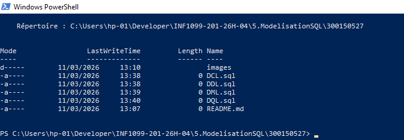

```
5.ModelisationSQL/
├── DDL.sql        # Création des tables (CREATE TABLE)
├── DML.sql        # Manipulation des données (INSERT / UPDATE / DELETE)
├── DQL.sql        # Requêtes de lecture (SELECT / JOIN / GROUP BY)
├── DCL.sql        # Contrôle des accès (GRANT / REVOKE / ROLES)
├── images/        # Captures d'écran de chaque étape
└── README.md
```

---

## 🗂️ Diagrammes de la base de données

### Diagramme Entité-Relation (ER)


### Diagramme relationnel (modèle logique)


---

## 🗄️ Tables du système

| Table               | Description                                            |
|---------------------|--------------------------------------------------------|
| `CompagnieAerienne` | Compagnies aériennes (nom, pays, code IATA)            |
| `Avion`             | Flotte d'avions liée aux compagnies                    |
| `Terminal`          | Terminaux de l'aéroport                                |
| `Gate`              | Portes d'embarquement par terminal                     |
| `Runway`            | Pistes d'atterrissage/décollage                        |
| `Vol`               | Vols (origine, destination, avion, gate, piste)        |
| `Passager`          | Passagers (nom, passeport, nationalité)                |
| `Reservation`       | Réservations de passagers sur des vols                 |
| `Billet`            | Billets émis (siège, classe)                           |
| `Bagage`            | Bagages des passagers                                  |
| `Personnel`         | Employés de l'aéroport                                 |
| `ControleSecurite`  | Contrôles de sécurité (passager + agent)               |
| `Maintenance`       | Interventions de maintenance sur les avions            |
| `Incident`          | Incidents signalés sur des vols                        |
| `ServiceSol`        | Services au sol assignés aux vols                      |

---

## Étape 1 — Création de la base de données

```sql
DROP DATABASE IF EXISTS aeroport;
CREATE DATABASE aeroport;
\c aeroport
CREATE SCHEMA aeroport;
```

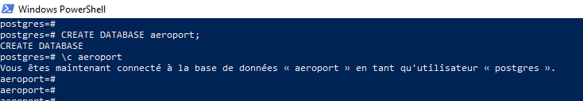

> ✅ La base `aeroport` est créée et le schéma `aeroport` est initialisé.

---

## Étape 2 — Création des tables (DDL)

Toutes les tables sont créées avec leurs **clés primaires**, **clés étrangères** et **contraintes de référence**.

### Exécution du script DDL automatique

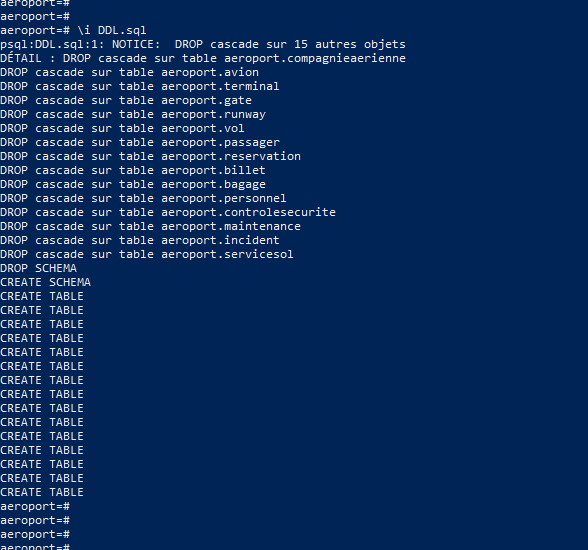

> PostgreSQL effectue un `DROP CASCADE` sur les 15 objets existants avant de recréer le schéma complet.

### Création manuelle des tables

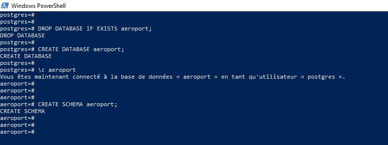

### Vérification — liste des 15 tables créées

```sql
\dt aeroport.*
```

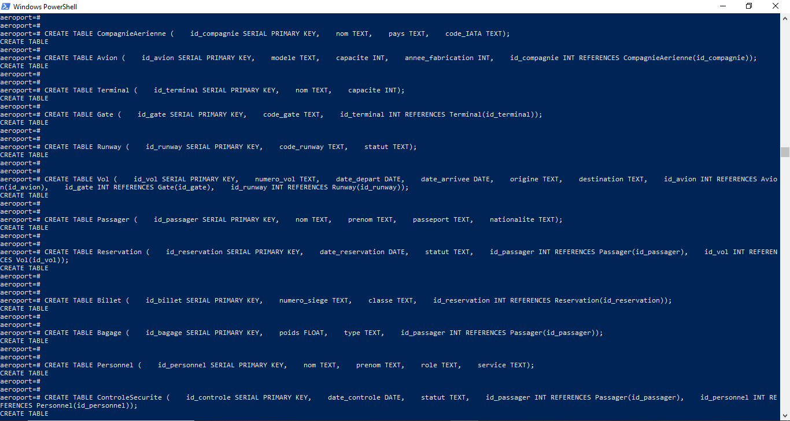

> ✅ Les 15 tables sont présentes : `avion`, `bagage`, `billet`, `compagnieaerienne`, `controlesecurite`, `gate`, `incident`, `maintenance`, `passager`, `personnel`, `reservation`, `runway`, `servicesol`, `terminal`, `vol`.

---

## Étape 3 — Insertion des données (DML — INSERT)

Les données sont insérées dans le **bon ordre** pour respecter les contraintes de clés étrangères.

### Exécution du script DML automatique

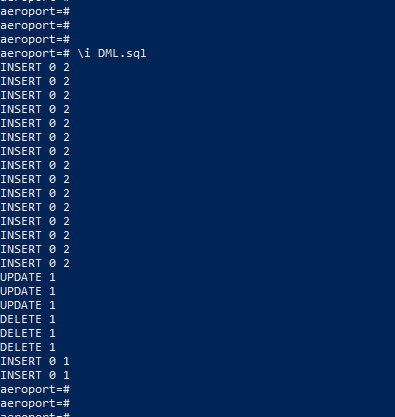

### Insertion manuelle — premier essai (erreur encodage)

Lors de la première tentative, une erreur d'encodage est survenue :

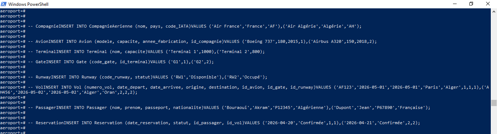

> ⚠️ **Problème :** Le fichier contenait des caractères accentués non compatibles UTF-8 (`é`, `è`).  
> **Solution :** Remplacer les caractères spéciaux par leurs équivalents ASCII (`Algerie` au lieu de `Algérie`) et sauvegarder en UTF-8 sans BOM.

### Insertion manuelle — après correction

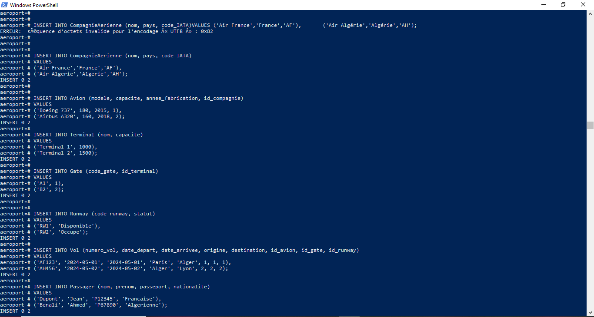

### Insertion depuis le fichier DML.sql (toutes les tables)

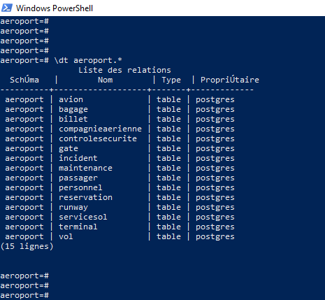

> ✅ Toutes les données sont insérées avec succès dans les 15 tables.

---

## Étape 4 — Lecture des données (DQL — SELECT)

### Requêtes simples

```sql
SELECT * FROM aeroport.Passager;
SELECT * FROM aeroport.Vol;
SELECT * FROM aeroport.Avion;
```

### Requêtes avec JOIN

```sql
-- Vol avec avion, gate et piste
SELECT v.numero_vol, v.origine, v.destination,
       a.modele AS avion, g.code_gate, r.code_runway
FROM Vol v
JOIN Avion a ON v.id_avion = a.id_avion
JOIN Gate g  ON v.id_gate  = g.id_gate
JOIN Runway r ON v.id_runway = r.id_runway;

-- Passagers et leurs vols
SELECT p.nom, p.prenom, v.numero_vol, v.destination
FROM Passager p
JOIN Reservation res ON p.id_passager = res.id_passager
JOIN Vol v ON res.id_vol = v.id_vol;
```

### Résultats — partie 1

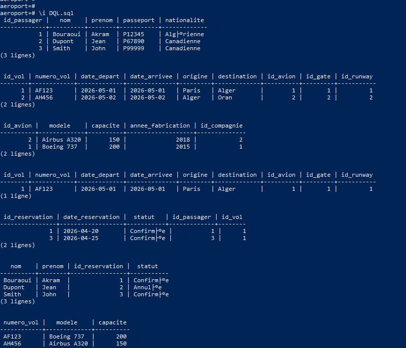

### Résultats — partie 2


### Résultats — partie 3


### Résultats avec JOIN et requêtes avancées

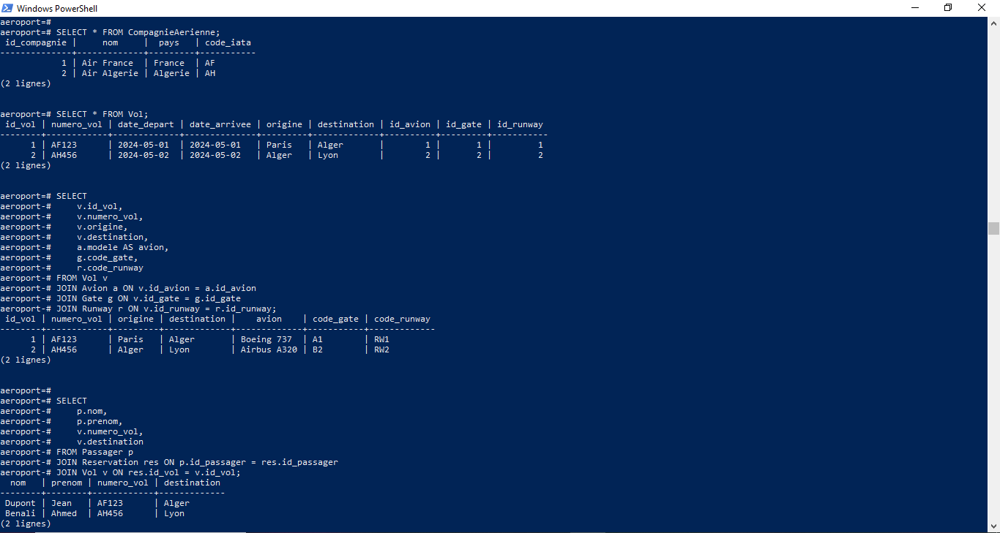

### Résultats complets DQL (manuel)

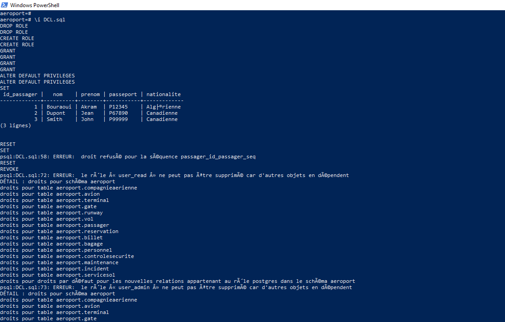


---

## Étape 5 — Modification des données (DML — UPDATE)

### UPDATE simple — modifier la nationalité d'un passager

```sql
UPDATE Passager
SET nationalite = 'Canadienne'
WHERE nom = 'Dupont';
```

### UPDATE avec condition — annuler une réservation

```sql
UPDATE Reservation
SET statut = 'Annulee'
WHERE id_reservation = 2;
```

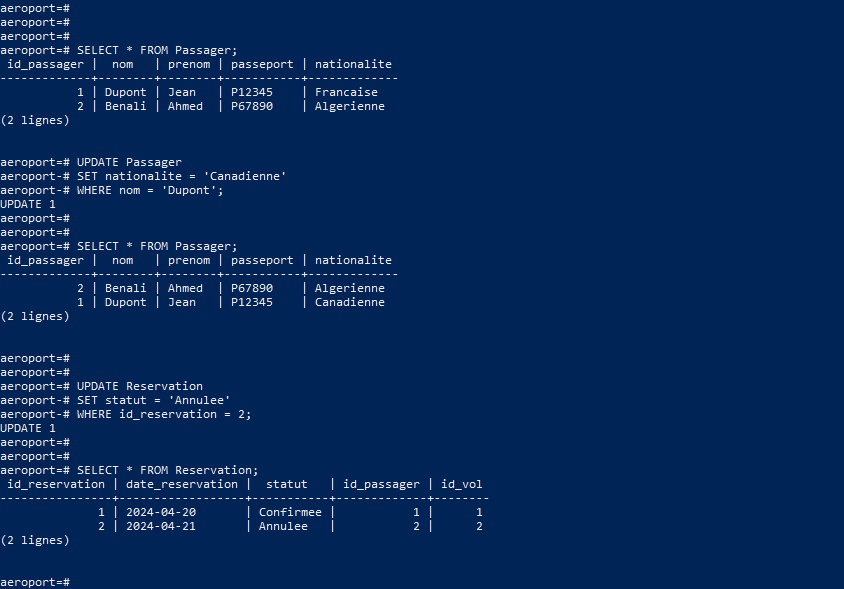

### UPDATE avec jointure — valider les réservations vers Lyon

```sql
UPDATE Reservation r
SET statut = 'Validee'
FROM Vol v
WHERE r.id_vol = v.id_vol
  AND v.destination = 'Lyon';
```


> ✅ Les mises à jour sont vérifiées avec `SELECT` après chaque opération.

---

## Étape 6 — Suppression des données (DML — DELETE)

### DELETE avec condition — supprimer les bagages légers

```sql
DELETE FROM Bagage
WHERE poids < 18;
```

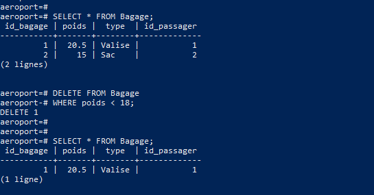

> ✅ Avant suppression : 2 bagages. Après suppression : 1 bagage (le sac de 15 kg est supprimé).

---

## Étape 7 — Contrôle des accès (DCL)

Deux rôles sont créés pour gérer la sécurité de la base :

| Rôle         | Permissions                                                          |
|--------------|----------------------------------------------------------------------|
| `user_read`  | `SELECT` uniquement sur toutes les tables                            |
| `user_admin` | `SELECT`, `INSERT`, `UPDATE`, `DELETE` + accès aux séquences SERIAL  |

### Exécution du script DCL automatique


### Problème rencontré — rôles non supprimables (dépendances)

Lors de la première exécution, les rôles ne peuvent pas être supprimés car des objets en dépendent :


> ⚠️ **Problème :** Les rôles possèdent encore des droits sur les tables du schéma.  
> **Solution :** Révoquer tous les droits (`REVOKE`) avant de supprimer les rôles (`DROP ROLE`).

### Attribution des droits

```sql
-- Accès au schéma
GRANT USAGE ON SCHEMA aeroport TO user_read;
GRANT USAGE ON SCHEMA aeroport TO user_admin;

-- Lecture seule
GRANT SELECT ON ALL TABLES IN SCHEMA aeroport TO user_read;

-- Accès complet
GRANT SELECT, INSERT, UPDATE, DELETE
  ON ALL TABLES IN SCHEMA aeroport TO user_admin;

-- Accès aux séquences (nécessaire pour INSERT avec SERIAL)
GRANT USAGE, SELECT ON ALL SEQUENCES IN SCHEMA aeroport TO user_admin;

-- Droits par défaut pour les nouvelles tables
ALTER DEFAULT PRIVILEGES IN SCHEMA aeroport
  GRANT SELECT ON TABLES TO user_read;

ALTER DEFAULT PRIVILEGES IN SCHEMA aeroport
  GRANT SELECT, INSERT, UPDATE, DELETE ON TABLES TO user_admin;
```


### Test de validation des permissions

```sql
-- user_read : peut lire, ne peut pas insérer
SET ROLE user_read;
SELECT * FROM aeroport.Passager;           -- ✅ Autorisé
INSERT INTO aeroport.Passager ...;         -- ❌ ERREUR : droit refusé

-- user_admin : peut insérer
SET ROLE user_admin;
INSERT INTO aeroport.Passager ...;         -- ✅ Autorisé
RESET ROLE;
```


### Révocation des droits et suppression des rôles

```sql
-- Révoquer tous les droits
REVOKE INSERT, UPDATE, DELETE ON ALL TABLES IN SCHEMA aeroport FROM user_admin;
REVOKE ALL PRIVILEGES ON ALL TABLES IN SCHEMA aeroport FROM user_read;
REVOKE ALL PRIVILEGES ON ALL TABLES IN SCHEMA aeroport FROM user_admin;
REVOKE USAGE ON SCHEMA aeroport FROM user_read;
REVOKE USAGE ON SCHEMA aeroport FROM user_admin;
REVOKE ALL PRIVILEGES ON ALL SEQUENCES IN SCHEMA aeroport FROM user_admin;

-- Supprimer les rôles
DROP ROLE user_read;
DROP ROLE user_admin;
```


> ✅ Tous les droits sont révoqués et les rôles sont supprimés avec succès après résolution des dépendances de séquences.

---

## 🧠 Erreurs rencontrées et solutions

| Erreur | Cause | Solution |
|--------|-------|----------|
| `séquence d'octets invalide UTF8 : 0x82` | Caractères accentués dans le fichier SQL | Remplacer par ASCII, sauvegarder en UTF-8 sans BOM |
| `le rôle ne peut pas être supprimé car d'autres objets en dépendent` | Droits encore attribués sur les tables | Exécuter `REVOKE` sur tables ET séquences avant `DROP ROLE` |
| `droit refusé pour la séquence passager_id_passager_seq` | `user_admin` n'avait pas accès aux séquences SERIAL | Ajouter `GRANT USAGE, SELECT ON ALL SEQUENCES` |

---

## ✅ Récapitulatif des scripts

| Script  | Statut | Contenu |
|---------|--------|---------|
| `DDL.sql` | ✅ | Création du schéma et des 15 tables |
| `DML.sql` | ✅ | INSERT, UPDATE, DELETE sur toutes les tables |
| `DQL.sql` | ✅ | SELECT simples, JOIN, GROUP BY, agrégations |
| `DCL.sql` | ✅ | CREATE ROLE, GRANT, REVOKE, DROP ROLE |
