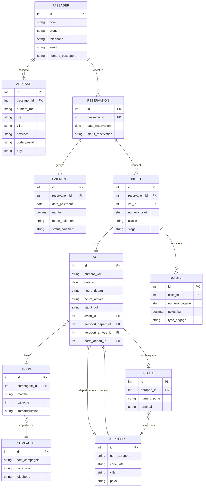

# Modelisation SQL - AeroVoyage
**Cours : INF1099 | Domaine : Systeme de reservation de compagnie aerienne**

---

## Structure du projet

```
MATRICULE/
├── README.md
├── images/
│   ├── Les tables creees (DDL).png
│   ├── Les donnees inserees (DML).png
│   ├── Les requetes (DQL).png
│   ├── Les permissions (DCL).png
│   └── La structure du projet.png
├── DDL.sql
├── DML.sql
├── DQL.sql
└── DCL.sql
```

---

## Domaine - AeroVoyage

AeroVoyage est un systeme de gestion de reservations pour une compagnie aerienne. Les passagers peuvent creer un profil, effectuer des reservations sur des vols, obtenir des billets, enregistrer des bagages et effectuer des paiements. Le systeme gere egalement les avions, les aeroports, les portes d'embarquement et les compagnies aeriennes.

---

## Diagramme Entite-Relation (ER)



---

## Normalisation

### 1FN - Premiere forme normale
Toutes les colonnes contiennent des valeurs atomiques (non divisibles). Chaque table possede une cle primaire unique. Aucun groupe repetitif.

Entites : Passager, Adresse, Compagnie, Aeroport, Porte, Avion, Vol, Reservation, Paiement, Billet, Bagage
Attributs atomiques : nom, prenom, email, numero_passeport, code_iata, date_vol, heure_depart, montant, poids_kg, classe

### 2FN - Deuxieme forme normale
Chaque attribut non-cle depend entierement de la cle primaire. Les relations sont separees en entites distinctes pour eliminer les dependances partielles.

```
PASSAGER     --  EFFECTUE    --  RESERVATION
RESERVATION  --  GENERE      --  PAIEMENT
RESERVATION  --  CONTIENT    --  BILLET
BILLET       --  ASSOCIE A   --  BAGAGE
BILLET       --  POUR        --  VOL
VOL          --  UTILISE     --  AVION
AVION        --  APPARTIENT  --  COMPAGNIE
VOL          --  DEPART      --  AEROPORT
VOL          --  ARRIVEE     --  AEROPORT
PORTE        --  SITUE DANS  --  AEROPORT
```

### 3FN - Troisieme forme normale
Aucune dependance transitive. Chaque attribut depend uniquement et directement de la cle primaire de sa table.

```
Passager     (id, nom, prenom, telephone, email, numero_passeport)
Adresse      (id, passager_id, numero_rue, rue, ville, province, code_postal, pays)
Compagnie    (id, nom_compagnie, code_iata, telephone)
Aeroport     (id, nom_aeroport, code_iata, ville, pays)
Porte        (id, aeroport_id, numero_porte, terminal)
Avion        (id, compagnie_id, modele, capacite, immatriculation)
Vol          (id, numero_vol, date_vol, heure_depart, heure_arrivee, statut_vol, avion_id, aeroport_depart_id, aeroport_arrivee_id, porte_depart_id)
Reservation  (id, passager_id, date_reservation, statut_reservation)
Paiement     (id, reservation_id, date_paiement, montant, mode_paiement, statut_paiement)
Billet       (id, reservation_id, vol_id, numero_billet, classe, siege)
Bagage       (id, billet_id, numero_bagage, poids_kg, type_bagage)
```

---

## DDL.sql - Definition des tables

Creation de toutes les tables avec cles primaires, cles etrangeres et contraintes d'integrite. Les 11 tables couvrent l'ensemble du systeme de reservation aerienne.

.png)

---

## DML.sql - Insertion des donnees

Insertion de donnees realistes : 5 passagers, 5 adresses, 3 compagnies, 4 aeroports, 5 portes, 3 avions, 4 vols, 5 reservations, 5 paiements, 5 billets et 6 bagages.

.png)

---

## DQL.sql - Requetes

| # | Requete | Description |
|---|---------|-------------|
| 1 | SELECT + JOIN | Tous les passagers avec leur adresse (ville et pays) |
| 2 | SELECT + JOIN multiple | Tous les billets avec passager, vol et compagnie |
| 3 | SELECT + WHERE | Reservations confirmees uniquement |
| 4 | SELECT + GROUP BY | Total paye par passager |
| 5 | SELECT + JOIN | Vols avec aeroport depart, arrivee et porte |

.png)

---

## DCL.sql - Gestion des droits

| Role | Droits |
|------|--------|
| passager_role | SELECT sur Vol, Aeroport, Porte, Compagnie, Billet, Bagage |
| agent_role | SELECT/INSERT/UPDATE sur Reservation, Paiement, Billet, Bagage + SELECT sur Passager, Vol |
| administrateur | ALL PRIVILEGES sur toutes les tables |

.png)

---

## Structure du projet


---

## Competences demontrees

- Analyse des besoins et modelisation conceptuelle d'un systeme aerien
- Diagramme Entite-Relation (ER) avec Mermaid (11 entites)
- Normalisation 1FN, 2FN, 3FN appliquee au domaine AeroVoyage
- Creation des tables avec contraintes et cles etrangeres (DDL)
- Insertion de donnees realistes representant un systeme de reservation (DML)
- Requetes avancees avec JOIN, GROUP BY, WHERE (DQL)
- Gestion des roles et permissions avec trois niveaux d'acces (DCL)
