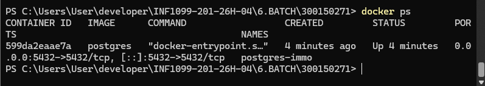
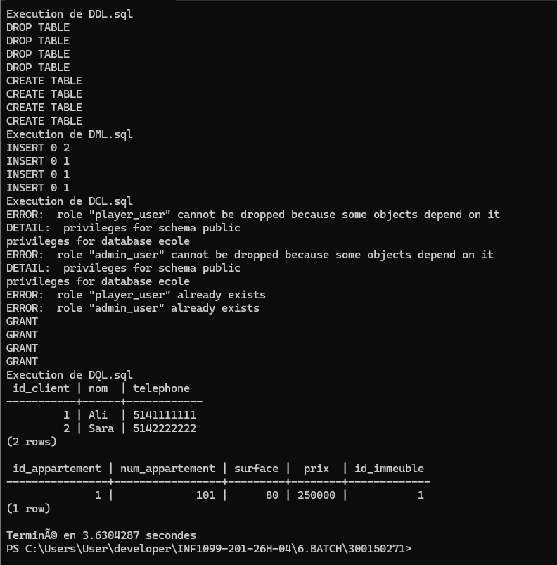
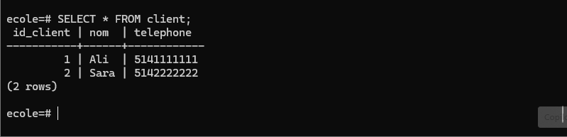

# 🧪 Lab 6 — Automatisation PostgreSQL avec PowerShell & Docker

INF1099 — Bases de données  
Étudiant : Mazigh Bareche  
Matricule : 300150271

---

## 📋 Table des matières

- 🎯 Objectif  
- 🛠 Technologies  
- 📁 Structure du projet  
- 🐳 Mise en place  
- ⚙️ Script PowerShell  
- 📊 Vérification des données  
- 📸 Captures  
- ✅ Résultats  

---

## 🎯 Objectif

Ce laboratoire consiste à automatiser le déploiement d’une base de données PostgreSQL à l’aide d’un script PowerShell exécuté dans un conteneur Docker.

Les scripts SQL sont exécutés dans l’ordre suivant :

DDL → DML → DCL → DQL

| Étape | Fichier | Rôle |
|------|--------|------|
| 1️⃣ | DDL.sql | Création des tables |
| 2️⃣ | DML.sql | Insertion des données |
| 3️⃣ | DCL.sql | Gestion des utilisateurs |
| 4️⃣ | DQL.sql | Vérification des données |

---

## 🛠 Technologies

- Docker  
- PostgreSQL  
- PowerShell  
- SQL  

---

## 📁 Structure du projet

6.BATCH/
└── 300150271/
    ├── DDL.sql
    ├── DML.sql
    ├── DCL.sql
    ├── DQL.sql
    ├── load-db.ps1
    └── images/

🖼️ Capture — Structure du projet  

---

## 🐳 Mise en place

### 1. Lancer PostgreSQL avec Docker

docker run -d --name postgres-immo -e POSTGRES_PASSWORD=postgres -e POSTGRES_DB=ecole -p 5432:5432 postgres

### 2. Vérifier le conteneur

docker ps

🖼️ Capture — Docker actif  

---

## ⚙️ Script PowerShell

Le script load-db.ps1 permet d’exécuter automatiquement tous les fichiers SQL.

### Exécution

.\load-db.ps1

🖼️ Capture — Exécution du script  

---

## 📊 Vérification des données

Connexion à PostgreSQL :

docker exec -it postgres-immo psql -U postgres -d ecole

Requête :

SELECT * FROM client;

🖼️ Capture — Résultat PostgreSQL  

---

## 📸 Captures

- Structure du projet  
- Docker actif  
- Exécution du script  
- Résultat PostgreSQL  

---

## ✅ Résultats

- Tables créées  
- Données insérées  
- Permissions appliquées  
- Script automatisé  
- Résultat validé  

---

## 🏁 Conclusion

Ce laboratoire montre comment automatiser complètement la création et l’utilisation d’une base de données PostgreSQL avec Docker et PowerShell.

---

## 👨‍🎓 Auteur

Mazigh Bareche  
INF1099 — Bases de données
