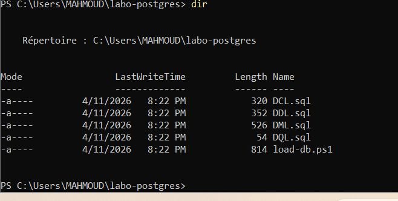
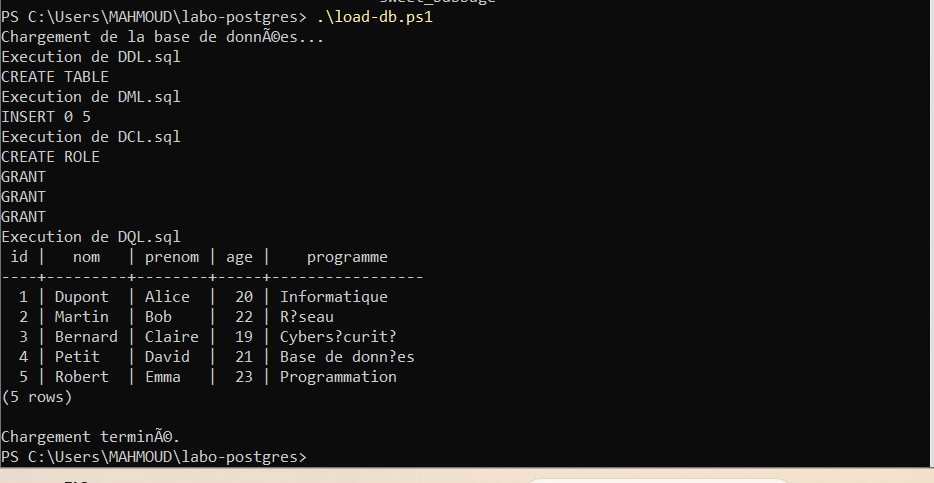
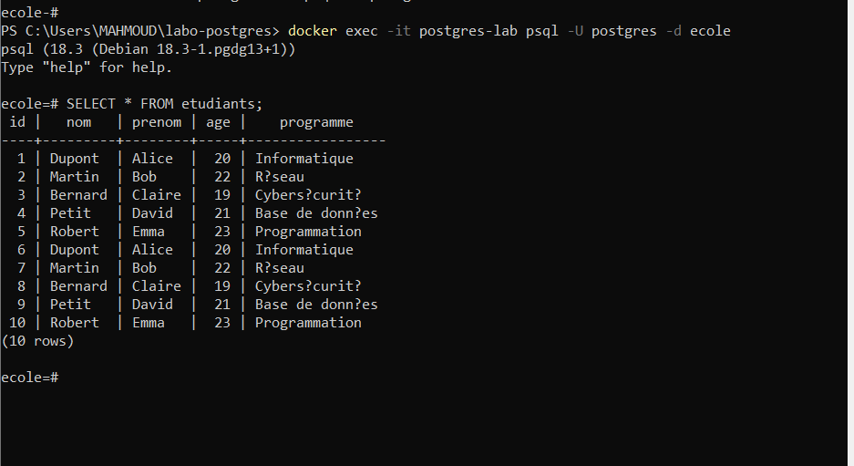

# 🧪🐘 TP PowerShell — Automatisation PostgreSQL avec Docker

## 👤 Informations de l’étudiant

* **Nom :** Aroua Mohand Tahar
* **Numéro étudiant :** 300150284

---

## 📌 Contexte du TP

Ce laboratoire consiste à automatiser le chargement d’une base de données PostgreSQL en utilisant :

* 🐳 Docker
* 🐘 PostgreSQL
* ⚙️ PowerShell

L’objectif est d’exécuter plusieurs scripts SQL automatiquement dans le bon ordre.

---

## 🎯 Objectifs pédagogiques

* 📊 Comprendre les types de scripts SQL (DDL, DML, DCL, DQL)
* 🐳 Déployer PostgreSQL avec Docker
* ⚙️ Automatiser l’exécution avec PowerShell
* 🔄 Charger une base automatiquement
* 🔍 Vérifier les résultats

---

## 🧱 Structure du projet

```text id="qf1g3x"
📁 Projet/
├── DDL.sql
├── DML.sql
├── DCL.sql
├── DQL.sql
├── load-db.ps1
└── 📁 images/
    ├── 1.png
    ├── 2.png
    └── 3.png
```

---

## ⚙️ Implémentation

### 🗄️ Types de scripts SQL

| Type | Description           |
| ---- | --------------------- |
| DDL  | Création des tables   |
| DML  | Insertion des données |
| DCL  | Gestion des droits    |
| DQL  | Requêtes SELECT       |

---

### 🔄 Ordre d’exécution

```text id="v6q3di"
DDL → DML → DCL → DQL
```

👉 Cet ordre garantit le bon fonctionnement du chargement.

---

## 🐳 Déploiement PostgreSQL

```powershell id="2xxc6y"
docker container run -d `
--name postgres-lab `
-e POSTGRES_PASSWORD=postgres `
-e POSTGRES_DB=ecole `
-p 5432:5432 `
postgres
```

---

## ⚙️ Script PowerShell

Le script `load-db.ps1` permet :

* 📥 de lire les fichiers SQL
* 🔁 de les exécuter automatiquement
* ✔️ d’afficher les résultats

---

## ▶️ Exécution

```powershell id="w6f2o3"
pwsh ./load-db.ps1
```

---

# 📸 Résultats obtenus (captures réelles)

---

## 🟢 1. Exécution du script PowerShell



👉 On observe :

* ✔️ CREATE TABLE (DDL exécuté)
* ✔️ INSERT 0 5 (DML exécuté)
* ✔️ CREATE ROLE + GRANT (DCL exécuté)
* ✔️ affichage des données (DQL)

👉 La base est chargée correctement sans erreur.

---

## 🟢 2. Vérification dans PostgreSQL



👉 Requête exécutée :

```sql id="d27h7m"
SELECT * FROM etudiants;
```

👉 Résultat :

* ✔️ données présentes dans la table
* ✔️ 10 lignes (car insertion exécutée 2 fois)
* ✔️ structure correcte

---

## 🟢 3. Structure des fichiers PowerShell



👉 On voit :

* ✔️ tous les fichiers SQL présents
* ✔️ script `load-db.ps1`
* ✔️ organisation correcte du projet

---

## 🔍 Analyse

* ✔️ La base fonctionne correctement
* ✔️ Les scripts sont exécutés dans le bon ordre
* ✔️ Les données sont bien insérées
* ✔️ Le script PowerShell automatise tout le processus

---

## ⚠️ Remarque importante

👉 On observe **10 lignes au lieu de 5** :

➡️ Cela signifie que le script a été exécuté **2 fois**

💡 Solution possible :

* vider la table avant insertion
* ou éviter les doublons

---

## 🎯 Conclusion

Ce TP démontre :

* ⚡ la puissance de PowerShell pour automatiser
* 🐳 l’efficacité de Docker
* 🐘 la flexibilité de PostgreSQL

👉 L’ensemble permet de créer un système **rapide, reproductible et automatisé**.

---

## 🚀 Améliorations possibles

* 🧾 ajouter un fichier log
* ⏱️ mesurer le temps d’exécution
* ⚙️ ajouter des paramètres au script
* 🔐 améliorer la gestion des erreurs

---

✨ **Fin du TP**
