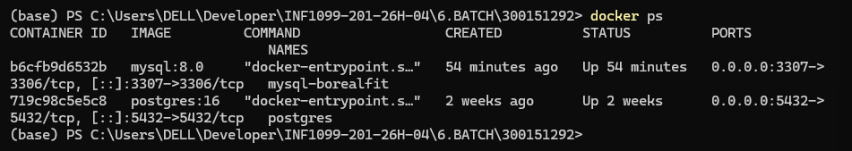
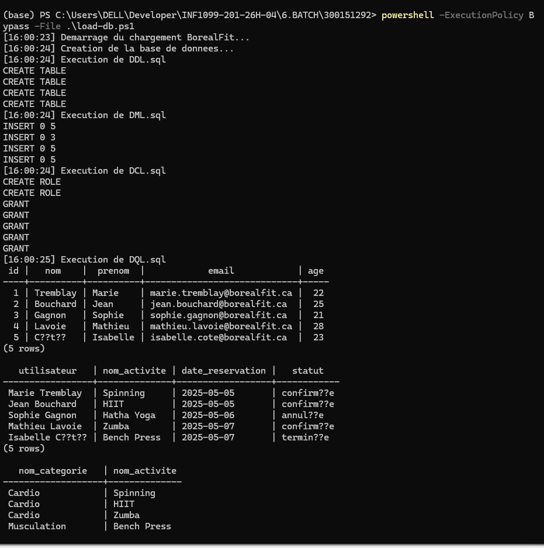
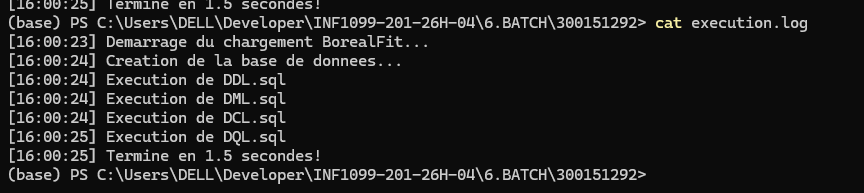
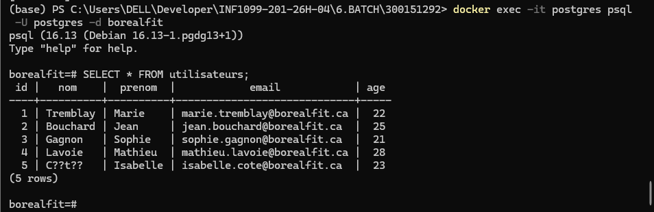
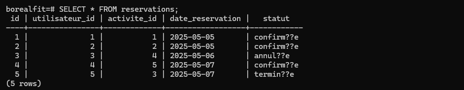

# 🏋️ TP Batch — PowerShell & PostgreSQL
## BorealFit — Automatisation du chargement de base de données

  

Automatisation complète du chargement d'une base de données PostgreSQL via un script PowerShell et un conteneur Docker.

**Auteur : Amine Kahil**  |  **No. étudiant : 300151292**  |  **Domaine : BorealFit**

---

## 📋 Table des matières

- [🎯 Objectifs](#-objectifs)
- [📁 Structure du projet](#-structure-du-projet)
- [🗂️ Types de scripts SQL](#-types-de-scripts-sql)
- [🐳 Démarrer avec Docker](#-démarrer-avec-docker)
- [⚡ Exécution rapide](#-exécution-rapide)
- [📝 Scripts SQL](#-scripts-sql)
- [🔧 Script PowerShell](#-script-powershell)
- [📊 Résultat](#-résultat)
- [🏆 Fonctionnalités bonus](#-fonctionnalités-bonus)
- [✅ Vérification](#-vérification)

---

## 🎯 Objectifs

| # | Objectif | Statut |
|---|----------|--------|
| 1 | Comprendre les types de scripts SQL (DDL, DML, DCL, DQL) | ✅ |
| 2 | Utiliser Docker pour exécuter PostgreSQL | ✅ |
| 3 | Écrire un script PowerShell d'automatisation | ✅ |
| 4 | Charger plusieurs scripts SQL automatiquement | ✅ |
| 5 | Bonus : paramètre, log, chronomètre | ✅ |

---

## 📁 Structure du projet

```
📦 300151292/
 ┣ 📄 DDL.sql              ← Création des tables
 ┣ 📄 DML.sql              ← Insertion des données
 ┣ 📄 DCL.sql              ← Permissions et rôles
 ┣ 📄 DQL.sql              ← Requêtes SELECT
 ┣ 📄 load-db.ps1          ← Script d'automatisation
 ┣ 📄 execution.log        ← Log généré automatiquement
 ┗ 📄 README.md
```

> ⚠️ Ordre d'exécution obligatoire : **DDL → DML → DCL → DQL**

---

## 🗂️ Types de scripts SQL

| Type | Signification | Commandes | Fichier |
|------|---------------|-----------|---------|
| 🏗️ DDL | Data Definition Language | CREATE, DROP, ALTER | DDL.sql |
| 📥 DML | Data Manipulation Language | INSERT, UPDATE, DELETE | DML.sql |
| 🔐 DCL | Data Control Language | GRANT, REVOKE | DCL.sql |
| 🔍 DQL | Data Query Language | SELECT | DQL.sql |

---

## 🐳 Démarrer avec Docker

**Vérifier que le conteneur postgres tourne**
```powershell
docker ps
```

✅ Conteneur `postgres` actif sur le port 5432



---

## ⚡ Exécution rapide

```powershell
# Lancer le script
powershell -ExecutionPolicy Bypass -File .\load-db.ps1

# Ou avec le nom du conteneur en paramètre (bonus)
.\load-db.ps1 postgres
```

---

## 📝 Scripts SQL

### 🏗️ DDL.sql — Création des tables

```sql
CREATE TABLE IF NOT EXISTS utilisateurs (
    id      SERIAL PRIMARY KEY,
    nom     VARCHAR(100) NOT NULL,
    prenom  VARCHAR(100) NOT NULL,
    email   VARCHAR(150) NOT NULL UNIQUE,
    age     INT
);
```

### 📥 DML.sql — Insertion des données

```sql
INSERT INTO utilisateurs (nom, prenom, email, age) VALUES
('Tremblay', 'Marie',   'marie.tremblay@borealfit.ca', 22),
('Bouchard', 'Jean',    'jean.bouchard@borealfit.ca',  25),
('Gagnon',   'Sophie',  'sophie.gagnon@borealfit.ca',  21);
```

### 🔐 DCL.sql — Permissions

```sql
CREATE USER lecteur_bf WITH PASSWORD 'lecteur123';
CREATE USER admin_bf   WITH PASSWORD 'admin123';
GRANT SELECT ON ALL TABLES IN SCHEMA public TO lecteur_bf;
GRANT SELECT, INSERT, UPDATE, DELETE ON ALL TABLES IN SCHEMA public TO admin_bf;
```

### 🔍 DQL.sql — Requêtes

```sql
SELECT
    u.prenom || ' ' || u.nom AS utilisateur,
    a.nom_activite,
    r.date_reservation,
    r.statut
FROM reservations r
JOIN utilisateurs u ON r.utilisateur_id = u.id
JOIN activites    a ON r.activite_id    = a.id;
```

---

## 🔧 Script PowerShell

```powershell
param([string]$Container = "postgres")

$Database = "borealfit"
$User     = "postgres"
$LogFile  = "execution.log"
$Files    = @("DDL.sql", "DML.sql", "DCL.sql", "DQL.sql")

function Write-Log {
    param([string]$Message)
    $line = "[$(Get-Date -Format 'HH:mm:ss')] $Message"
    Write-Output $line
    Add-Content -Path $LogFile -Value $line
}

$start = Get-Date
Write-Log "Demarrage du chargement BorealFit..."

$running = docker ps --format "{{.Names}}" | Select-String $Container
if (-not $running) {
    Write-Log "ERREUR : conteneur non actif"
    exit 1
}

foreach ($file in $Files) {
    if (-not (Test-Path $file)) {
        Write-Log "ERREUR : fichier manquant : $file"
        exit 1
    }
    Write-Log "Execution de $file"
    Get-Content $file | docker exec -i $Container psql -U $User -d $Database
}

$duree = ((Get-Date) - $start).TotalSeconds
Write-Log "Termine en $([math]::Round($duree, 2)) secondes!"
```

**Explication des commandes clés :**

| Commande | Rôle |
|----------|------|
| `param(...)` | Accepte le nom du conteneur en argument |
| `Test-Path` | Vérifie qu'un fichier existe |
| `Get-Content` | Lit le contenu d'un fichier SQL |
| `docker exec -i` | Exécute une commande dans le conteneur |
| `psql` | Client PostgreSQL qui reçoit le SQL |
| `Add-Content` | Écrit dans le fichier log |

---

## 📊 Résultat

✅ Exécution complète du script — DDL, DML, DCL, DQL chargés en 1.5 secondes



✅ Fichier log généré automatiquement



---

## 🏆 Fonctionnalités bonus

**1. Conteneur en paramètre**
```powershell
.\load-db.ps1 postgres
```

**2. Fichier log horodaté — `execution.log`**
```
[16:00:23] Demarrage du chargement BorealFit...
[16:00:24] Creation de la base de donnees...
[16:00:24] Execution de DDL.sql
[16:00:24] Execution de DML.sql
[16:00:24] Execution de DCL.sql
[16:00:25] Execution de DQL.sql
[16:00:25] Termine en 1.5 secondes!
```

**3. Temps d'exécution**

Le script affiche automatiquement le temps total en secondes.

---

## ✅ Vérification

```powershell
docker exec -it postgres psql -U postgres -d borealfit
```

**SELECT * FROM utilisateurs**



**SELECT * FROM reservations**



---

## 🎯 Conclusion

Ce laboratoire démontre comment automatiser le chargement d'une base de données PostgreSQL avec PowerShell et Docker. Les quatre types de scripts SQL ont été exécutés avec succès en 1.5 secondes, avec journalisation complète dans `execution.log` et affichage du temps d'exécution.

---

*Laboratoire BATCH — PostgreSQL & PowerShell · Amine Kahil · 300151292*
