# 🐘 TP PostgreSQL — Fonctions, Procédures Stockées et Triggers

## 👤 Informations de l'étudiant
- **Nom :** Adjaoud Hocine
- **Numéro étudiant :** 300148450

---

## 📌 Description du laboratoire

Ce laboratoire a pour objectif de découvrir les langages procéduraux dans PostgreSQL à travers l'utilisation de **fonctions**, de **procédures stockées** et de **triggers** en **PL/pgSQL**.

Le projet permet de comprendre comment intégrer une logique métier directement dans la base de données afin d'automatiser certaines validations, journaliser des opérations et améliorer la cohérence des données.

---

## 🎯 Objectifs pédagogiques

À la fin de ce laboratoire, l'étudiant sera capable de :

- distinguer une **fonction** d'une **procédure stockée**
- créer et exécuter du code en **PL/pgSQL**
- utiliser des **triggers** pour automatiser des actions
- gérer les erreurs avec `RAISE NOTICE` et `RAISE EXCEPTION`
- tester le comportement de la base dans différents scénarios

---

## 🧠 Concepts abordés

### Fonction
Une fonction retourne une valeur et peut être utilisée dans une requête SQL.

Exemple :
```sql
SELECT nombre_etudiants_par_age(18, 25);
```

### Procédure stockée
Une procédure exécute une série d'actions, sans retourner directement une valeur dans un `SELECT`.

Exemple :
```sql
CALL ajouter_etudiant('Ali', 22, 'ali@email.com');
```

### Trigger
Un trigger exécute automatiquement une fonction lorsqu'un événement survient sur une table (`INSERT`, `UPDATE`, `DELETE`).

---

## 📁 Structure du projet

```text
300148450/
│
├── init/
│   ├── 01-ddl.sql
│   ├── 02-dml.sql
│   └── 03-programmation.sql
│
├── tests/
│   └── test.sql
│
├── images/
│   ├── 1.png
│   ├── 2.png
│   ├── ...
│   └── 13.png
│
└── README.md
```

---

## ⚙️ Environnement technique

- **SGBD :** PostgreSQL 15
- **Langage procédural :** PL/pgSQL
- **Conteneurisation :** Docker
- **Utilisateur :** etudiant
- **Mot de passe :** etudiant
- **Base de données :** tpdb

---

## 🚀 Lancement du conteneur PostgreSQL

### PowerShell

```powershell
docker run -d `
  --name tp_postgres `
  -e POSTGRES_USER=etudiant `
  -e POSTGRES_PASSWORD=etudiant `
  -e POSTGRES_DB=tpdb `
  -p 5432:5432 `
  -v ${PWD}/init:/docker-entrypoint-initdb.d `
  postgres:15
```

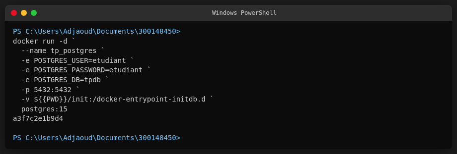

### Linux / macOS

```bash
docker run -d \
  --name tp_postgres \
  -e POSTGRES_USER=etudiant \
  -e POSTGRES_PASSWORD=etudiant \
  -e POSTGRES_DB=tpdb \
  -p 5432:5432 \
  -v ${PWD}/init:/docker-entrypoint-initdb.d \
  postgres:15
```

---

## 🔄 Connexion à PostgreSQL

```bash
docker container exec -it tp_postgres psql -U etudiant -d tpdb
```

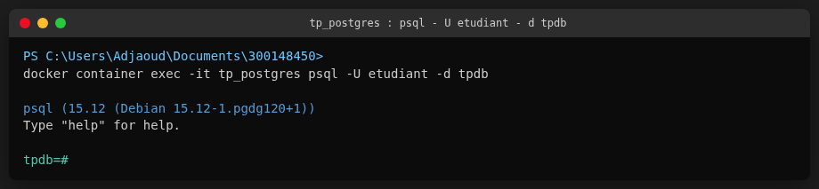

---

## 📂 Description des fichiers

### `01-ddl.sql`
Ce fichier contient la création des tables :
- `etudiants`
- `cours`
- `inscriptions`
- `logs`

### `02-dml.sql`
Ce fichier contient les données initiales insérées dans les tables :
- étudiants de départ
- cours disponibles

### `03-programmation.sql`
Ce fichier contient toute la logique procédurale du laboratoire :
- procédure `ajouter_etudiant`
- fonction `nombre_etudiants_par_age`
- procédure `inscrire_etudiant_cours`
- trigger de validation
- trigger de journalisation

### `tests/test.sql`
Ce fichier permet d'exécuter les tests afin de vérifier que :
- les insertions valides fonctionnent
- les validations bloquent les données invalides
- les fonctions retournent les bonnes valeurs
- les logs sont bien générés

---

## ▶️ Exécution pas à pas

### Étape 1 — Création des tables (DDL)

```bash
\i init/01-ddl.sql
```

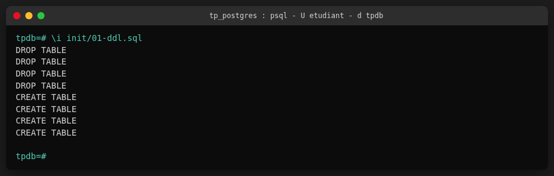

Les quatre tables `etudiants`, `cours`, `inscriptions` et `logs` sont créées avec succès. Les anciennes tables sont d'abord supprimées avec `DROP TABLE ... CASCADE` pour garantir un état propre.

### Étape 2 — Insertion des données initiales (DML)

```bash
\i init/02-dml.sql
```

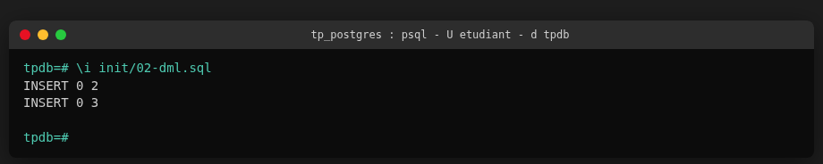

Deux étudiants (Test, Sara) et trois cours (Base de donnees, Programmation, Reseautique) sont insérés dans la base de données.

### Étape 3 — Création des procédures, fonctions et triggers

```bash
\i init/03-programmation.sql
```

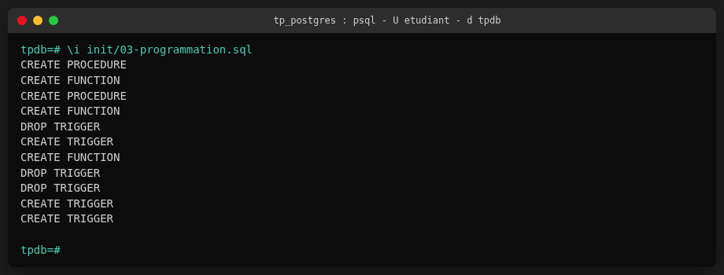

Toute la logique procédurale est déployée : procédures stockées, fonctions, triggers de validation et de journalisation.

---

## 🧪 Tests réalisés

### Test 1 — Ajout d'un étudiant valide

```sql
CALL ajouter_etudiant('Ali', 22, 'ali@email.com');
```

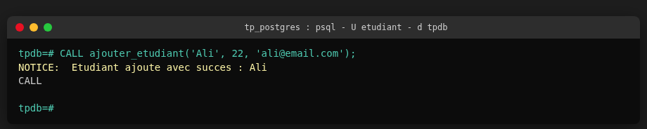

L'étudiant Ali est ajouté avec succès. La procédure valide l'âge (22 >= 18), vérifie le format de l'email, s'assure que l'email n'est pas déjà utilisé, puis insère l'étudiant et journalise l'action.

### Test 2 — Test d'un âge invalide

```sql
DO $$
BEGIN
    BEGIN
        CALL ajouter_etudiant('Bob', 15, 'bob@email.com');
    EXCEPTION
        WHEN others THEN
            RAISE NOTICE 'Test age invalide : OK';
    END;
END;
$$;
```

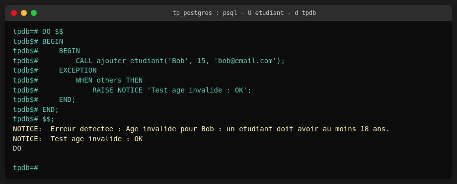

L'insertion de Bob (15 ans) est correctement refusée. La procédure détecte que l'âge est inférieur à 18 ans et lève une exception. Le bloc `EXCEPTION` intercepte l'erreur et confirme que le test est réussi.

### Test 3 — Test d'un email invalide

```sql
DO $$
BEGIN
    BEGIN
        CALL ajouter_etudiant('Karim', 21, 'karim-email-invalide');
    EXCEPTION
        WHEN others THEN
            RAISE NOTICE 'Test email invalide : OK';
    END;
END;
$$;
```

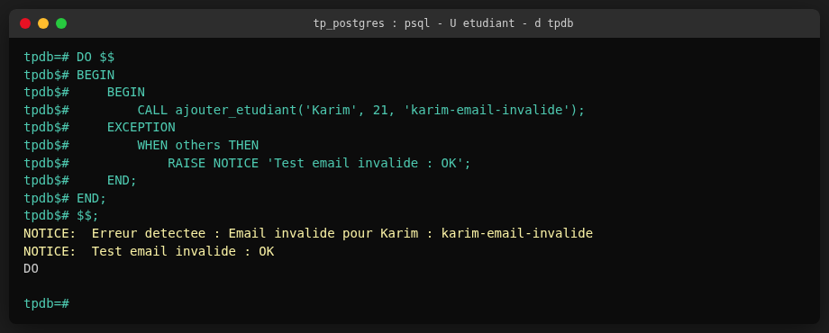

L'insertion de Karim avec un email sans `@` est rejetée. La validation par expression régulière dans la procédure refuse les emails mal formatés.

### Test 4 — Fonction `nombre_etudiants_par_age`

```sql
SELECT nombre_etudiants_par_age(18, 25) AS total_18_25;
```

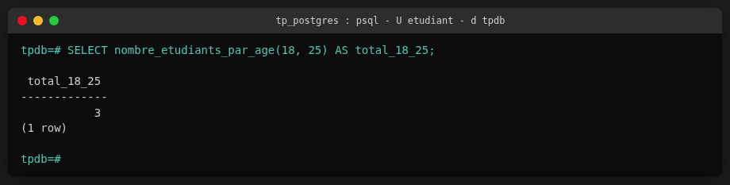

La fonction retourne `3`, ce qui correspond aux trois étudiants (Test 20 ans, Sara 23 ans, Ali 22 ans) dont l'âge se situe entre 18 et 25 ans inclus.

### Test 5 — Inscription à un cours

```sql
CALL inscrire_etudiant_cours('ali@email.com', 'Base de donnees');
```

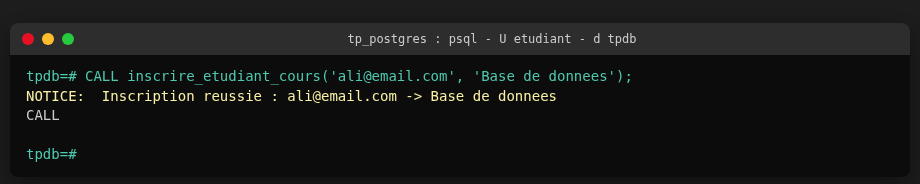

Ali est inscrit avec succès au cours « Base de donnees ». La procédure vérifie l'existence de l'étudiant et du cours, s'assure qu'il n'y a pas de doublon, puis crée l'inscription et journalise l'action.

---

## ✅ Vérification des données

### Table `etudiants`

```sql
SELECT * FROM etudiants ORDER BY id;
```

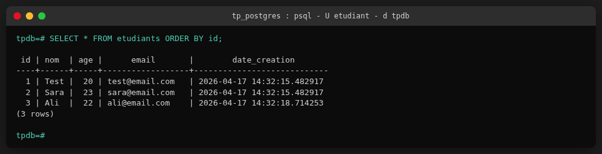

Trois étudiants sont présents dans la base : Test (20 ans), Sara (23 ans) et Ali (22 ans), chacun avec un email unique et une date de création automatique.

### Table `inscriptions`

```sql
SELECT * FROM inscriptions ORDER BY id;
```

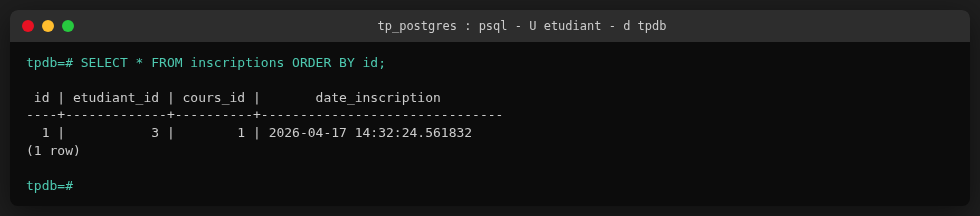

Une inscription a été créée : Ali (id=3) est inscrit au cours « Base de donnees » (id=1).

### Table `logs`

```sql
SELECT * FROM logs ORDER BY id;
```

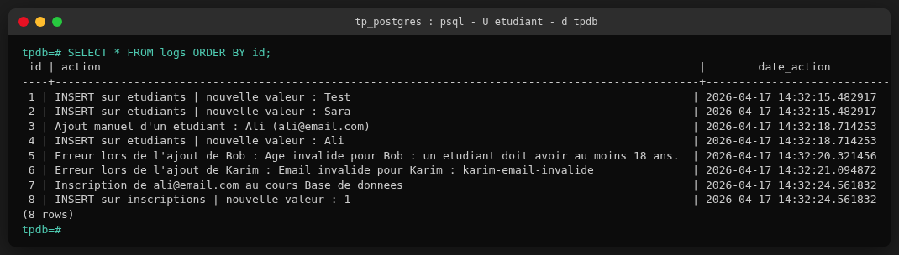

Huit entrées de journalisation sont enregistrées, couvrant :
- les insertions automatiques par trigger (INSERT sur `etudiants`)
- l'ajout manuel d'Ali via la procédure
- les erreurs capturées pour Bob (âge invalide) et Karim (email invalide)
- l'inscription d'Ali au cours et le trigger associé

---

## 🛡️ Validation et journalisation

Ce TP met en évidence deux mécanismes importants :

### Validation
Le trigger `trg_valider_etudiant` vérifie automatiquement :
- que l'âge est valide
- que l'adresse email respecte un format acceptable

### Journalisation
Les triggers de log enregistrent automatiquement les opérations effectuées sur :
- la table `etudiants`
- la table `inscriptions`

Cela permet de conserver une trace des actions réalisées dans la base.

---

## 📚 Bonnes pratiques appliquées

- validation des données avant insertion
- gestion des erreurs avec messages explicites
- séparation claire entre structure, données, logique et tests
- utilisation d'un environnement Docker reproductible
- scripts organisés pour faciliter la maintenance

---

## 📎 Remarque

Ce travail a été réalisé dans un cadre pédagogique afin de mettre en pratique les fonctions, procédures stockées et triggers dans PostgreSQL avec Docker.
