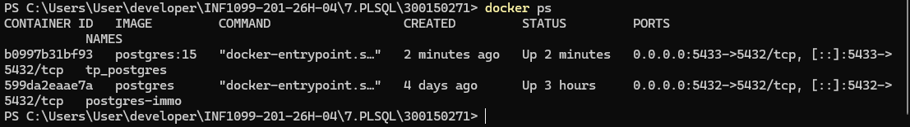
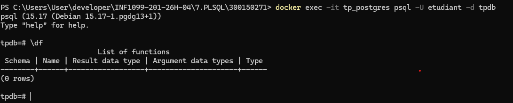
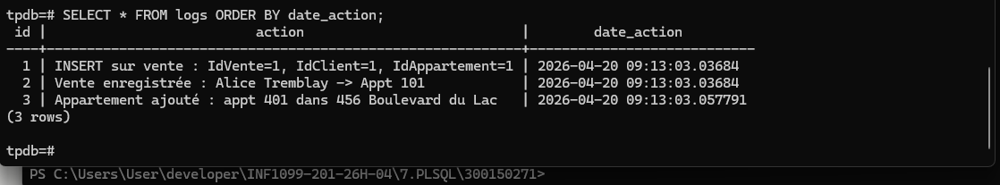

# 🏢 TP PostgreSQL — Stored Procedures
### Fonctions, Procédures Stockées et Triggers
> **Cours :** INF1099 · **Étudiant :** [Votre Nom] · **No. étudiant :** 300150271

---

## 🎯 Objectifs du TP

| # | Objectif |
|---|----------|
| 1 | Comprendre la différence entre **fonction** et **procédure** |
| 2 | Créer et utiliser des **procédures** en PL/pgSQL |
| 3 | Créer et utiliser des **fonctions** |
| 4 | Utiliser les **triggers** pour automatiser des actions |
| 5 | Gérer les **erreurs** et les **validations** |

---

## 📁 Structure du Projet

```
300150271/
│
├── init/
│   ├── 01-ddl.sql            ← Structure des tables
│   ├── 02-dml.sql            ← Données initiales
│   └── 03-programmation.sql  ← Procédures, fonctions, triggers
│
├── tests/
│   └── test.sql              ← Scénarios de test
│
├── images/                   ← Captures d'écran
│
└── README.md
```

---

## 🗂️ Modèle de données

```
erDiagram
    CLIENT {
        int IdClient PK
        string Nom
        string Telephone
    }
    IMMEUBLE {
        int IdImmeuble PK
        string Adresse
        string Ville
    }
    APPARTEMENT {
        int IdAppartement PK
        int NumAppartement
        float Surface
        float Prix
        int IdImmeuble FK
    }
    VENTE {
        int IdVente PK
        date DateVente
        int IdClient FK
        int IdAppartement FK
    }
    CLIENT ||--o{ VENTE : achete
    APPARTEMENT ||--o{ VENTE : est_vendu_dans
    IMMEUBLE ||--o{ APPARTEMENT : contient
```

---

## 🗂️ Concepts Utilisés

| Élément | Description | Exemple |
|---------|-------------|---------|
| `FUNCTION` | Retourne une valeur | `SELECT chiffre_affaires_ville('Montréal');` |
| `PROCEDURE` | Exécute des actions | `CALL enregistrer_vente(1, 2);` |
| `TRIGGER` | Exécuté automatiquement | Sur `INSERT` / `UPDATE` / `DELETE` |

---

## 🐳 Lancer PostgreSQL avec Docker

### 🪟 Windows (PowerShell)

```powershell
docker run -d `
  --name tp_postgres `
  -e POSTGRES_USER=etudiant `
  -e POSTGRES_PASSWORD=etudiant `
  -e POSTGRES_DB=tpdb `
  -p 5433:5432 `
  -v ${PWD}/init:/docker-entrypoint-initdb.d `
  postgres:15
```

---

## 🖼️ Captures d'écran

### 📌 01 — Conteneur Docker lancé



---

### 📌 02 — Tables créées dans PostgreSQL


---

### 📌 03 — Fonctions et procédures



---

### 📌 04 — Triggers créés


---

### 📌 05 — Tests exécutés


---

### 📌 06 — Logs automatiques



---

## 📋 Description des Fichiers SQL

### 1️⃣ `01-ddl.sql` — Structure

Définit les tables de la base de données :

- `client` — Informations sur les acheteurs
- `immeuble` — Immeubles disponibles avec adresse et ville
- `appartement` — Appartements (surface, prix, immeuble parent)
- `vente` — Transactions reliant un client à un appartement
- `logs` — Journal automatique des actions

---

### 2️⃣ `02-dml.sql` — Données initiales

Insère les données de départ :

- **4 clients** de test
- **3 immeubles** dans différentes villes
- **4 appartements** répartis dans les immeubles

---

### 3️⃣ `03-programmation.sql` — PL/pgSQL

#### ✅ Procédure : `enregistrer_vente`

- Vérifie que le **client existe**
- Vérifie que l'**appartement existe**
- Vérifie que l'appartement **n'est pas déjà vendu**
- Insère la vente dans la table `vente`
- Génère un **log automatique**

#### ✅ Fonction : `chiffre_affaires_ville`

- Retourne le **total des prix de vente** pour une ville donnée
- Jointure entre `vente`, `appartement` et `immeuble`

#### ✅ Procédure : `ajouter_appartement`

- Vérifie que l'**immeuble existe**
- Vérifie que la **surface et le prix sont positifs**
- Insère l'appartement
- Génère un **log automatique**

#### ✅ Trigger : `trg_valider_appartement`

- Vérifie automatiquement **Surface > 0** et **Prix > 0** avant chaque insertion

#### ✅ Trigger : `trg_log_vente`

- Enregistre **toutes les actions** (`INSERT`, `UPDATE`, `DELETE`) dans la table `logs`
- Gestion distincte pour `DELETE` (utilise `OLD`) et `INSERT/UPDATE` (utilise `NEW`)

---

## 🧪 Exécution des Tests

```powershell
Get-Content .\tests\test.sql | docker exec -i tp_postgres psql -U etudiant -d tpdb
```

---

## 🔍 Connexion manuelle à PostgreSQL

```powershell
docker exec -it tp_postgres psql -U etudiant -d tpdb
```

---

## 🔍 Vérification des Données

```sql
SELECT * FROM client;
SELECT * FROM immeuble;
SELECT * FROM appartement;
SELECT * FROM vente;
SELECT * FROM logs ORDER BY date_action;
```

---

## ✅ Résultat Final

| Élément | Statut |
|---------|--------|
| Procédures | ✔ Fonctionnelles |
| Fonction | ✔ Fonctionnelle |
| Triggers | ✔ Fonctionnels |
| Logs automatiques | ✔ Générés correctement |

---

## 💡 Conclusion

Ce TP démontre l'utilisation de **PL/pgSQL** pour :

- Intégrer de la **logique métier** directement dans la base de données (validation des ventes, cohérence des données)
- **Automatiser des actions** grâce aux triggers (journalisation, validation)
- **Sécuriser et valider** les données en amont (surface, prix, unicité des ventes)

> 👉 Le domaine immobilier a été choisi pour illustrer des cas concrets : un appartement ne peut être vendu qu'une seule fois, les prix doivent être positifs, et chaque transaction est tracée automatiquement dans les logs.
