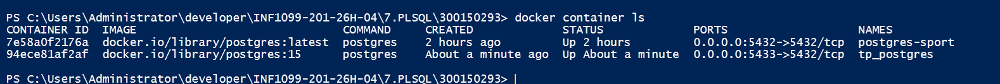
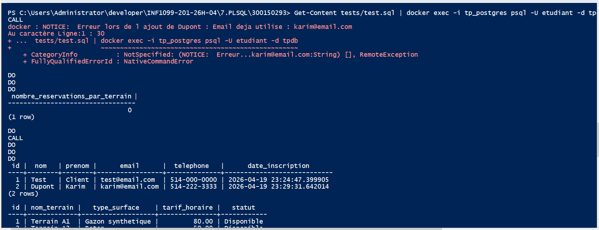
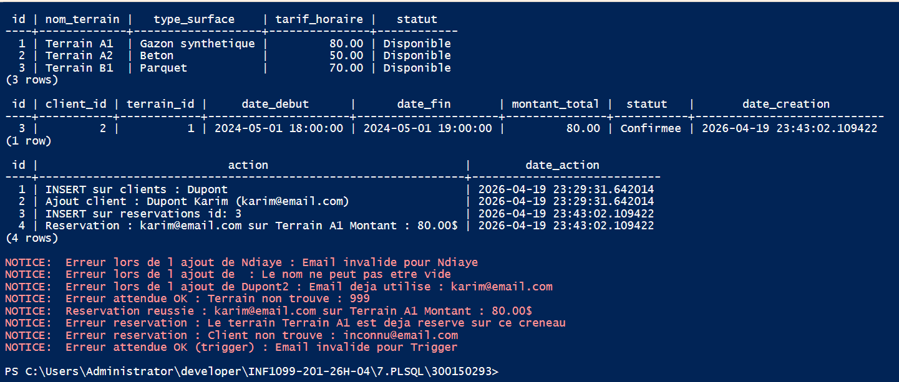
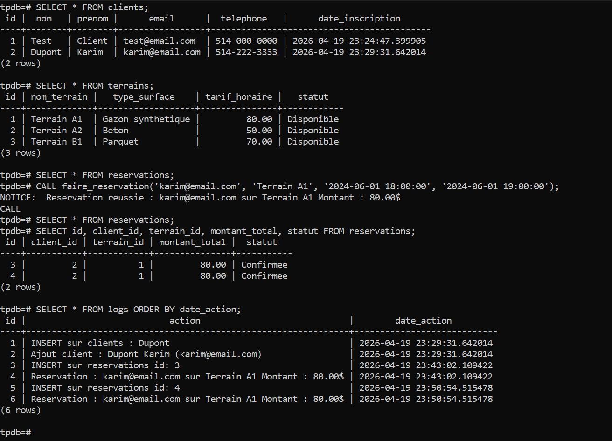

# 🗄️ TP PostgreSQL — Procédures stockées
## Fonctions, Procédures Stockées et Triggers
## Centre Sportif — Gestion de Terrains & Réservations


---

## 🎯 Objectifs

| # | Objectif |
|---|----------|
| 1 | Expliquer la différence entre fonction et procédure stockée |
| 2 | Créer et appeler des fonctions et procédures en PL/pgSQL |
| 3 | Utiliser les triggers pour automatiser la logique métier |
| 4 | Gérer les exceptions et la journalisation dans PostgreSQL |

---

## 📁 Structure du projet

```
300150293/
│
├── initialisation/
│   ├── 01-ddl.sql              ← Création des tables
│   ├── 02-dml.sql              ← Données initiales
│   └── 03-programmation.sql   ← Fonctions, procédures, triggers
│
├── tests/
│   └── test.sql                ← Fichier de tests complets
│
├── images/
└── README.md
```

---

## 🗂️ Définitions clés

| Élément | Description | Exemple d'appel |
|---------|-------------|-----------------|
| **FONCTION** | Retourne une valeur, utilisable dans un `SELECT` | `SELECT nombre_reservations_par_terrain(1);` |
| **PROCÉDURE** | Ne retourne pas de valeur, gère les transactions | `CALL ajouter_client('Dupont', 'Karim', 'karim@email.com', '514-222-3333');` |
| **TRIGGER** | Exécuté automatiquement sur `INSERT`, `UPDATE`, `DELETE` | Automatique |

---

## 🐳 Lancez PostgreSQL avec Docker

### Étape 1 : Créer et lancer le conteneur

```powershell
docker run -d `
  --name tp_postgres `
  -e POSTGRES_USER=etudiant `
  -e POSTGRES_PASSWORD=etudiant `
  -e POSTGRES_DB=tpdb `
  -p 5432:5432 `
  -v ${PWD}/initialisation:/docker-entrypoint-initdb.d `
  postgres:15
```

> ℹ️ Le flag `-v` monte le dossier `initialisation/` dans le conteneur — PostgreSQL exécute automatiquement tous les fichiers `.sql` au démarrage dans l'ordre alphabétique.

### Étape 2 : Vérifier que le conteneur est actif

```powershell
docker container ls
```

<details>
<summary>📋 Résultat attendu</summary>

```
CONTAINER ID   IMAGE         STATUS        PORTS                    NAMES
a1b2c3d4e5f6   postgres:15   Up 2 seconds  0.0.0.0:5432->5432/tcp   tp_postgres
```

</details>

<details>
<summary>🖼️ Capture d'écran</summary>



</details>

---

## 📝 Fichiers SQL

### `01-ddl.sql` — Structure des tables

| Table | Description |
|-------|-------------|
| `clients` | Clients avec nom, prénom, email, téléphone |
| `terrains` | Terrains disponibles avec tarif horaire |
| `reservations` | Lien client ↔ terrain avec créneau et montant |
| `logs` | Journal automatique de toutes les opérations |

### `02-dml.sql` — Données initiales

- 3 terrains de test
- 1 client de test

### `03-programmation.sql` — PL/pgSQL

#### 1️⃣ Procédure `ajouter_client`

```sql
CALL ajouter_client('Dupont', 'Karim', 'karim@email.com', '514-222-3333');
```

Validations :
- Nom non vide
- Format email valide
- Email unique
- Journalisation automatique dans `logs`

#### 2️⃣ Fonction `nombre_reservations_par_terrain`

```sql
SELECT nombre_reservations_par_terrain(1);
```

- Retourne le nombre de réservations pour un terrain donné
- Valide que le terrain existe

#### 3️⃣ Procédure `faire_reservation`

```sql
CALL faire_reservation('karim@email.com', 'Terrain A1', '2024-05-01 18:00:00', '2024-05-01 19:00:00');
```

Validations :
- Client existe
- Terrain existe
- Date début avant date fin
- Pas de conflit de créneau
- Calcul automatique du montant
- Journalisation dans `logs`

#### 4️⃣ Trigger `trg_valider_client`

- Déclenché **AVANT l'INSERT** sur `clients`
- Valide automatiquement le format email et le nom
- Bloque l'insertion si invalide

#### 5️⃣ Triggers `trg_log_client` et `trg_log_reservation`

- Déclenchés **APRÈS INSERT / UPDATE / DELETE**
- Journalisent chaque opération avec les valeurs `OLD` et `NEW`
- Permettent un historique complet des modifications

---

## ✅ Exécuter les tests

### Option A — Manuellement (connecté dans le conteneur)

```powershell
docker container exec -it tp_postgres psql -U etudiant -d tpdb
```

Puis taper les commandes SQL directement dans le terminal PostgreSQL.

### Option B — Automatiquement (depuis PowerShell, hors conteneur)

```powershell
Get-Content tests/test.sql | docker exec -i tp_postgres psql -U etudiant -d tpdb
```

<details>
<summary>🖼️ Capture d'écran</summary>



</details>

---

## 📋 Tests couverts

| # | Test | Résultat |
|---|------|----------|
| 1 | Insertion client valide | ✅ Client ajouté |
| 2 | Email invalide | ✅ Exception capturée |
| 3 | Nom vide | ✅ Exception capturée |
| 4 | Email doublon | ✅ Erreur unique_violation |
| 5 | Fonction terrain valide | ✅ Nombre retourné |
| 6 | Terrain inexistant | ✅ Exception capturée |
| 7 | Réservation valide | ✅ Réservation créée |
| 8 | Doublon de réservation | ✅ Exception capturée |
| 9 | Client inexistant | ✅ Exception capturée |
| 10 | Trigger INSERT direct invalide | ✅ Trigger bloque |

<details>
<summary>🖼️ Capture d'écran</summary>



</details>

---

## 🔍 Vérification finale

Se connecter d'abord au conteneur :

```powershell
docker container exec -it tp_postgres psql -U etudiant -d tpdb
```

Puis exécution :

```sql
SELECT * FROM clients;
SELECT * FROM terrains;
SELECT * FROM reservations;
SELECT * FROM logs ORDER BY date_action;
```

<details>
<summary>🖼️ Capture d'écran</summary>



</details>
