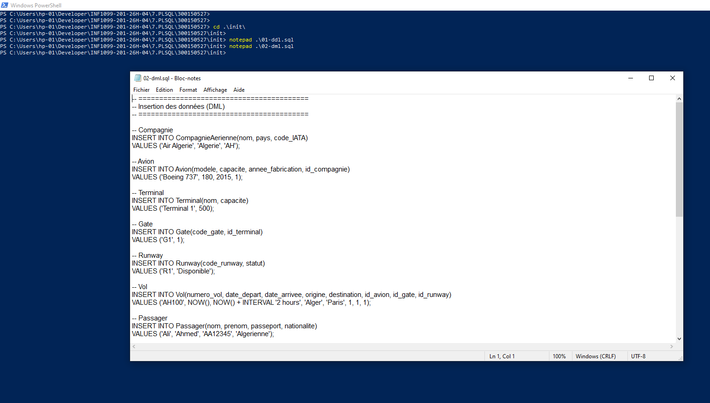
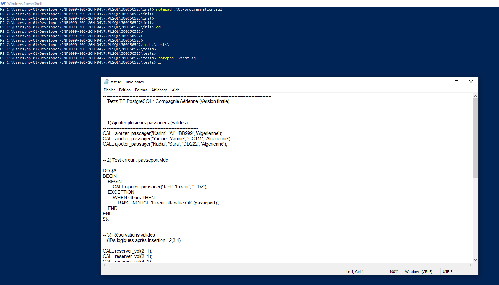
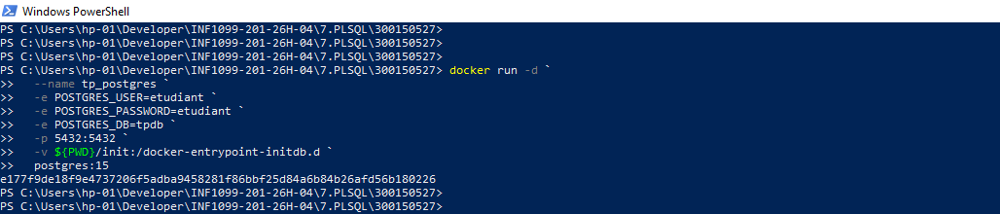
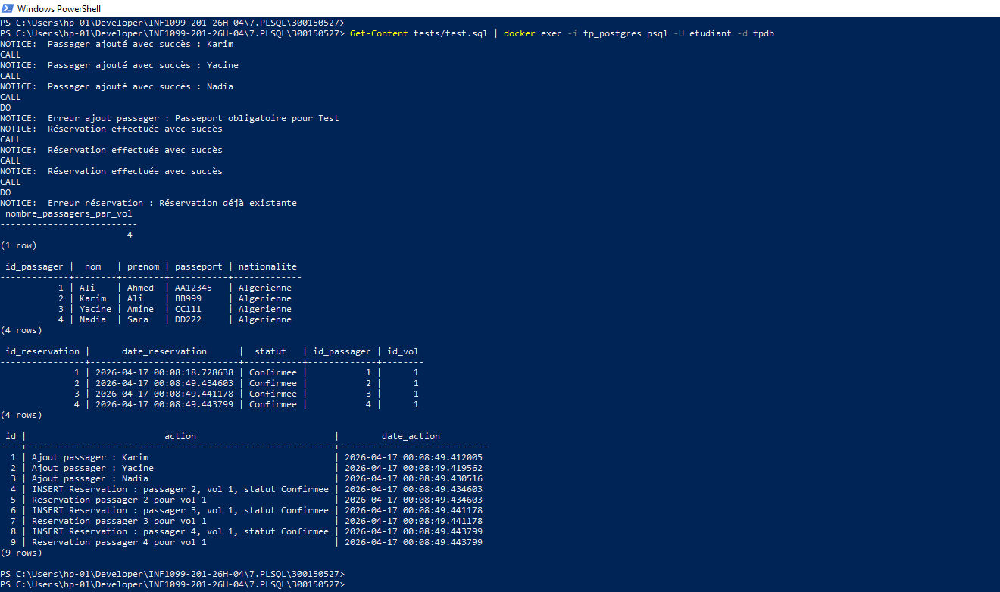
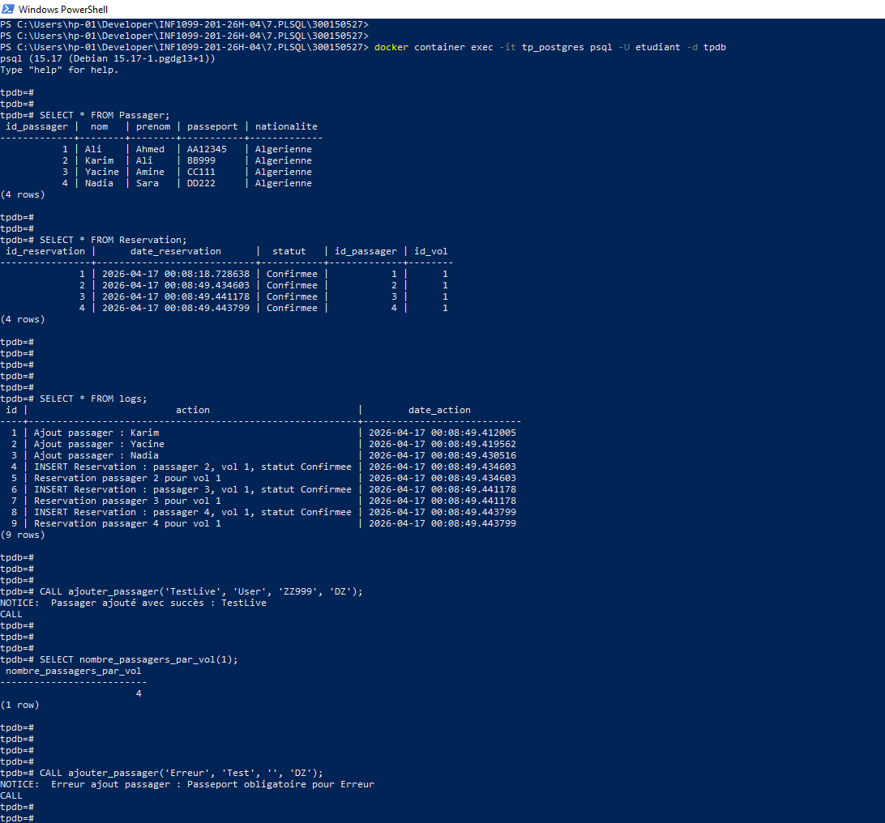

# ✈️ TP PostgreSQL – Compagnie Aérienne

> **INF1099 – Collège Boréal** &nbsp;|&nbsp; Étudiant : `300150527`

Base de données PostgreSQL pour la gestion d'une compagnie aérienne — création des tables, insertion des données, procédures, fonctions et triggers.

---

## 📂 Structure du projet

```bash
300150527/
│
├── images/                    # 📸 Captures d'écran
├── init/
│   ├── 01-ddl.sql             # Création des tables
│   ├── 02-dml.sql             # Insertion des données
│   └── 03-programmation.sql   # Procédures, fonctions, triggers
│
├── tests/
│   └── test.sql               # Tests complets
│
└── README.md
```

> **Structure du projet sur disque**
>
> 
> 

---

## 🧱 Contenu des fichiers

### 🔹 `01-ddl.sql` — Schéma de la base de données

Création des tables :

| Table | Rôle |
|---|---|
| `logs` | Journal des actions automatiques |
| `CompagnieAerienne` | Données des compagnies |
| `Avion` | Parc d'avions avec référence compagnie |
| `Terminal` | Terminaux de l'aéroport |
| `Gate` | Portes d'embarquement |
| `Runway` | Pistes avec statut |
| `Vol` | Vols (départ, arrivée, avion, gate) |
| `Passager` | Passagers avec passeport et nationalité |
| `Reservation` | Réservations liées aux vols |


---

### 🔹 `02-dml.sql` — Données initiales

Insertion d'un jeu de données de départ :

- **Compagnie** : Air Algérie (`AH`, Algérie)
- **Avion** : Boeing 737, capacité 180, fabriqué en 2015
- **Terminal** : Terminal 1, capacité 500
- **Gate** : G1 &nbsp;|&nbsp; **Runway** : R1 (Disponible)
- **Vol** : AH100 (Alger → Paris)
- **Passager** : Ali Ahmed, passeport AA12345



---

### 🔹 `03-programmation.sql` — Programmation PL/pgSQL

#### ✅ Procédures stockées

| Procédure | Description |
|---|---|
| `ajouter_passager` | Ajoute un passager avec validation du passeport et log automatique |
| `reserver_vol` | Crée une réservation avec contrôle des doublons |

#### ✅ Fonction

| Fonction | Description |
|---|---|
| `nombre_passagers_par_vol(id_vol)` | Retourne le nombre de passagers pour un vol donné |

#### ✅ Triggers

- **Validation du passeport** : bloque l'ajout si le passeport est vide ou nul
- **Logs automatiques** : enregistre chaque opération sur `Reservation`


---

### 🔹 `tests/test.sql` — Suite de tests

| Test | Résultat attendu |
|---|---|
| Ajout de 3 passagers (Karim, Yacine, Nadia) | ✔️ Succès |
| Ajout sans passeport | ✔️ Erreur capturée |
| Réservations vol 1 (passagers 2, 3, 4) | ✔️ Confirmées |
| Réservation en doublon | ✔️ Erreur détectée |
| `SELECT nombre_passagers_par_vol(1)` | ✔️ Retourne 4 |
| Affichage `Passager`, `Reservation`, `logs` | ✔️ Données correctes |



---

## 🐳 Lancement avec Docker

### 1. Démarrer le conteneur PostgreSQL

```bash
docker run -d \
  --name tp_postgres \
  -e POSTGRES_USER=etudiant \
  -e POSTGRES_PASSWORD=etudiant \
  -e POSTGRES_DB=tpdb \
  -p 5432:5432 \
  -v ${PWD}/init:/docker-entrypoint-initdb.d \
  postgres:15
```



### 2. Vérifier que le conteneur est actif

```bash
docker ps
```


### 3. Exécuter les tests

```bash
Get-Content tests/test.sql | docker exec -i tp_postgres psql -U etudiant -d tpdb
```

### 4. Accès interactif à la base

```bash
docker container exec -it tp_postgres psql -U etudiant -d tpdb
```

---

## 🧪 Résultats obtenus

### Exécution des tests via PowerShell



### Vérification interactive via psql



| Élément vérifié | Résultat |
|---|---|
| Passagers insérés | 4 (Ali, Karim, Yacine, Nadia) |
| Réservations confirmées | 4 |
| Erreur passeport vide | ✔️ Gérée |
| Doublon de réservation | ✔️ Détecté |
| Logs automatiques | 9 entrées |
| `nombre_passagers_par_vol(1)` | 4 |

---

## 🚀 Fonctionnalités principales

- ✨ Gestion complète des passagers
- ✨ Réservation de vols avec contrôle métier
- ✨ Validation des données via exceptions PL/pgSQL
- ✨ Logs automatiques via triggers
- ✨ Suite de tests reproductible

---

## 🧠 Conclusion

Ce projet démontre :

- ✔️ Maîtrise de PostgreSQL et du langage PL/pgSQL
- ✔️ Utilisation des procédures stockées, fonctions et triggers
- ✔️ Gestion robuste des erreurs et des cas limites
- ✔️ Déploiement et exécution dans un environnement Docker isolé

---

## 👨‍💻 Auteur

| Champ | Valeur |
|---|---|
| Étudiant | `300150527` |
| Cours | INF1099 |
| Institution | Collège Boréal |
| Date | Avril 2026 |
