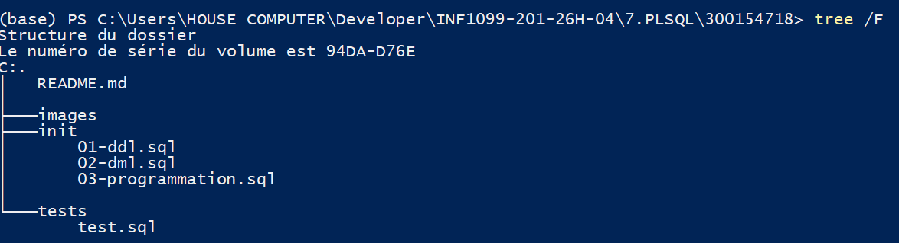
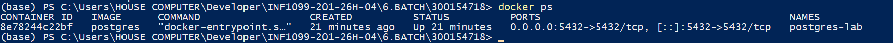
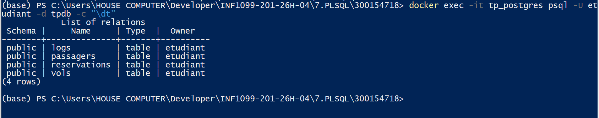
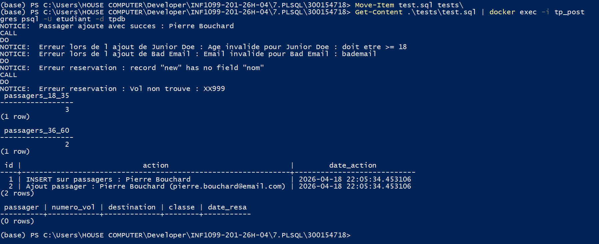

# 🗄️ TP PostgreSQL — Procédures Stockées
### Fonctions, Procédures Stockées et Triggers
> **Cours :** INF1099 · **Domaine :** AeroVoyage (Compagnie Aérienne)

---

## 🎯 Objectifs du TP

| # | Objectif |
|---|----------|
| 1 | Comprendre la différence entre **fonction** et **procédure** |
| 2 | Créer et utiliser des **procédures** en PL/pgSQL |
| 3 | Créer et utiliser des **fonctions** |
| 4 | Utiliser les **triggers** pour automatiser des actions |
| 5 | Gérer les **erreurs** et les **validations** |

---

## 📁 Structure du Projet

```
300154718/
│
├── init/
│   ├── 01-ddl.sql           ← Structure des tables
│   ├── 02-dml.sql           ← Données initiales
│   └── 03-programmation.sql ← Procédures, fonctions, triggers
│
├── tests/
│   └── test.sql             ← Scénarios de test
│
├── images/                  ← Captures d'écran
│
└── README.md
```



---

## 🐳 Lancer PostgreSQL avec Docker

```powershell
docker run -d `
  --name tp_postgres `
  -e POSTGRES_USER=etudiant `
  -e POSTGRES_PASSWORD=etudiant `
  -e POSTGRES_DB=tpdb `
  -p 5432:5432 `
  -v ${PWD}/init:/docker-entrypoint-initdb.d `
  postgres:15
```



---

## 🗂️ Concepts Utilisés

| Élément | Description | Exemple |
|---------|-------------|---------|
| `FUNCTION` | Retourne une valeur | `SELECT nombre_passagers_par_age(18, 35);` |
| `PROCEDURE` | Exécute des actions | `CALL ajouter_passager('Marie', 'marie@email.com', 34, 'CA123');` |
| `TRIGGER` | Exécuté automatiquement | Sur `INSERT` / `UPDATE` / `DELETE` |

---

## 📋 Description des Fichiers SQL

### 1️⃣ `01-ddl.sql` — Structure

Définit les tables de la base de données :

- `passagers` — Informations sur les passagers
- `vols` — Catalogue des vols disponibles
- `reservations` — Relations passager ↔ vol
- `logs` — Journal des actions automatiques



---

### 2️⃣ `02-dml.sql` — Données initiales

Insère les données de départ :

- **4 passagers** de test
- **4 vols** disponibles

---

### 3️⃣ `03-programmation.sql` — PL/pgSQL

#### ✅ Procédure : `ajouter_passager`
- Vérifie que l'âge est **≥ 18**
- Vérifie que l'**email est valide** (format)
- Vérifie que le **passeport est unique**
- Ajoute le passager dans la base
- Génère un **log automatique**

#### ✅ Fonction : `nombre_passagers_par_age`
- Retourne le **nombre de passagers** dans une tranche d'âge donnée

#### ✅ Procédure : `reserver_vol`
- Vérifie que le **passager existe**
- Vérifie que le **vol existe**
- Vérifie les **places disponibles**
- Vérifie l'**absence de doublon**
- Enregistre la réservation et met à jour les places
- Génère un **log automatique**

#### ✅ Trigger : Validation passager
- Vérifie automatiquement l'**âge** et le format de l'**email** à chaque insertion

#### ✅ Trigger : Journalisation (logs)
- Enregistre **toutes les actions** (`INSERT`, `UPDATE`, `DELETE`) dans la table `logs`

---

## 🧪 Exécution des Tests

```powershell
Get-Content .\tests\test.sql | docker exec -i tp_postgres psql -U etudiant -d tpdb
```



---

## 🔍 Vérification des Données

```sql
SELECT * FROM passagers;
SELECT * FROM vols;
SELECT * FROM reservations;
SELECT * FROM logs ORDER BY date_action;
```

---

## ✅ Résultat Final

| Élément | Statut |
|---------|--------|
| Procédures | ✔ Fonctionnelles |
| Fonction | ✔ Fonctionnelle |
| Triggers | ✔ Fonctionnels |
| Logs automatiques | ✔ Générés correctement |

---

## 💡 Conclusion

Ce TP démontre l'utilisation de **PL/pgSQL** pour :

- Intégrer de la **logique métier** directement dans la base de données
- **Automatiser des actions** grâce aux triggers
- **Sécuriser et valider** les données en amont

> 👉 Le domaine AeroVoyage (compagnie aérienne) a été utilisé pour illustrer des cas réels : ajout de passagers, réservation de vols, validation et journalisation automatique.

---

*Cours INF1099 — Bases de données · AeroVoyage*
