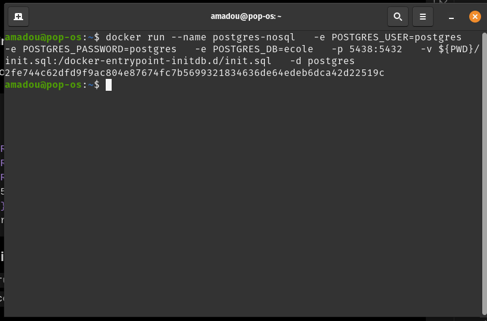
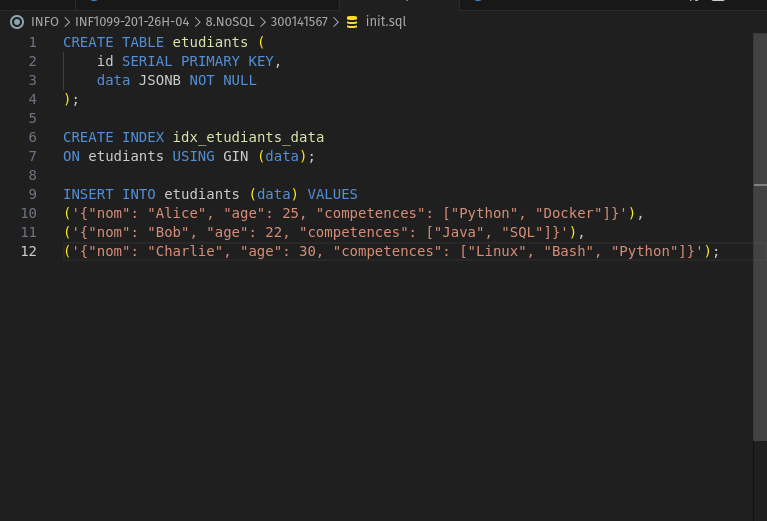
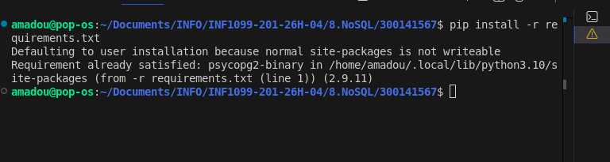
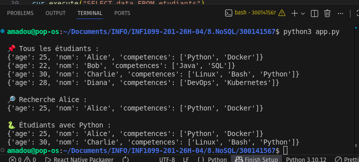

# 🧪 TP : NoSQL 


## 🎯 Objectif

Construire une mini base NoSQL avec :

* PostgreSQL (JSONB)
* Docker (conteneur simple)
* Python + `requirements.txt` pour les dépendances

---

# Nom : Sow
# Prenom : Amadou

# 🧱 1️⃣ Lancer PostgreSQL avec Docker


- [ ] 🐧 *nix 

```bash id="d6kq7x"
docker run --name postgres-nosql \
  -e POSTGRES_USER=postgres \
  -e POSTGRES_PASSWORD=postgres \
  -e POSTGRES_DB=ecole \
  -p 5432:5432 \
  -v ${PWD}/init.sql:/docker-entrypoint-initdb.d/init.sql \
  -d postgres
```

---

# 📄 2️⃣ Fichier SQL unique : `init.sql`

👉 Crée la table + charge les données

```sql id="g8m2pq"
CREATE TABLE etudiants (
    id SERIAL PRIMARY KEY,
    data JSONB NOT NULL
);

CREATE INDEX idx_etudiants_data
ON etudiants USING GIN (data);

INSERT INTO etudiants (data) VALUES
('{"nom": "Alice", "age": 25, "competences": ["Python", "Docker"]}'),
('{"nom": "Bob", "age": 22, "competences": ["Java", "SQL"]}'),
('{"nom": "Charlie", "age": 30, "competences": ["Linux", "Bash", "Python"]}');
```
---


# 📦 3️⃣ Dépendances Python

## 📄 `requirements.txt`

```txt id="k1n7rt"
psycopg2-binary
```

---

## 📥 Installation

```bash id="p9x2lm"
pip install -r requirements.txt
```


---

# 🐍 4️⃣ Script Python

## 📄 `app.py`

```python id="t3v9qa"
import psycopg2
import json

conn = psycopg2.connect(
    dbname="ecole",
    user="postgres",
    password="postgres",
    host="localhost",
    port=5438
)

cur = conn.cursor()

# 🔹 INSERT
nouvel_etudiant = {
    "nom": "Diana",
    "age": 28,
    "competences": ["DevOps", "Kubernetes"]
}

cur.execute(
    "INSERT INTO etudiants (data) VALUES (%s)",
    [json.dumps(nouvel_etudiant)]
)

conn.commit()

# 🔹 SELECT ALL
print("\n📌 Tous les étudiants :")
cur.execute("SELECT data FROM etudiants")

for row in cur.fetchall():
    print(row[0])

# 🔹 SEARCH BY NAME
print("\n🔎 Recherche Alice :")
cur.execute("""
    SELECT data FROM etudiants
    WHERE data->>'nom' = 'Alice'
""")

for row in cur.fetchall():
    print(row[0])

# 🔹 SEARCH compétence Python (BON BONUS TP)
print("\n🐍 Étudiants avec Python :")
cur.execute("""
    SELECT data FROM etudiants
    WHERE data->'competences' ? 'Python'
""")

for row in cur.fetchall():
    print(row[0])

cur.close()
conn.close()
```

---


---

## 🔵 Execution du scripy Python

* Installer dépendances via `requirements.txt`
* Connexion PostgreSQL
* INSERT JSON
* SELECT ALL
* Recherche filtrée

---



