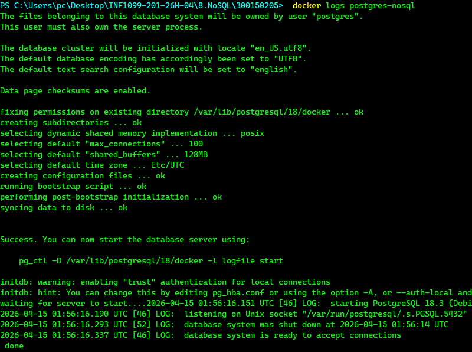
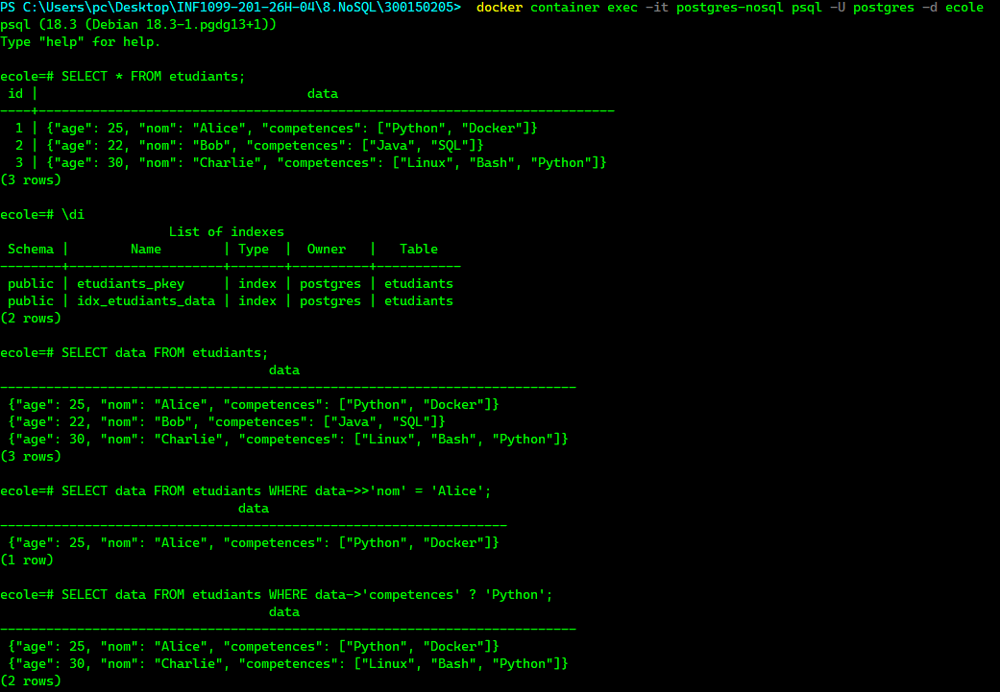

<div align="center">

# 🗄️ TP NoSQL — PostgreSQL JSONB + Python
### Mini base NoSQL avec PostgreSQL, Docker et Python


</div>

---

## 🎯 Objectifs

| # | Objectif |
|---|----------|
| 1 | Déployer PostgreSQL avec Docker |
| 2 | Utiliser JSONB comme stockage NoSQL |
| 3 | Connecter Python à PostgreSQL via psycopg2 |
| 4 | Effectuer des opérations CRUD sur des données JSON |

---

## 📁 Structure du projet

```
300150205/
├── README.md
├── images/
├── init.sql          ← Création table + données initiales
├── app.py            ← Script Python CRUD
└── requirements.txt  ← Dépendances Python
```

---

## 🗂️ Opérateurs JSONB utilisés

| Opérateur | Rôle | Exemple |
|-----------|------|---------|
| `->>`  | Accède à un champ texte | `data->>'nom' = 'Alice'` |
| `->`   | Accède à un champ JSON | `data->'competences'` |
| `?`    | Vérifie si une clé/valeur existe | `data->'competences' ? 'Python'` |
| `\|\|` | Fusionne deux objets JSON (UPDATE) | `data \|\| '{"age": 23}'::jsonb` |

---

## 🐳 Partie 1 — Docker

### Étape 1 : Lancer PostgreSQL

**Windows (PowerShell) :**

```powershell
docker run --name postgres-nosql `
  -e POSTGRES_USER=postgres `
  -e POSTGRES_PASSWORD=postgres `
  -e POSTGRES_DB=ecole `
  -p 5432:5432 `
  -v ${PWD}/init.sql:/docker-entrypoint-initdb.d/init.sql `
  -d postgres
```

**Linux/Mac :**

```bash
docker run --name postgres-nosql \
  -e POSTGRES_USER=postgres \
  -e POSTGRES_PASSWORD=postgres \
  -e POSTGRES_DB=ecole \
  -p 5432:5432 \
  -v ${PWD}/init.sql:/docker-entrypoint-initdb.d/init.sql \
  -d postgres
```

### Étape 2 : Vérifier le conteneur

```powershell
docker container ls
```

<details>
<summary>📋 Output attendu</summary>

```
CONTAINER ID   IMAGE      STATUS        PORTS                    NAMES
a1b2c3d4e5f6   postgres   Up 2 seconds  0.0.0.0:5432->5432/tcp   postgres-nosql
```
</details>

### Étape 3 : Vérifier le chargement de init.sql

```powershell
docker logs postgres-nosql
```


<details>
<summary>🖼️ Capture d'écran</summary>



</details>

---

## 🟡 Partie 2 — SQL NoSQL

### Vérifier la table et l'index

Se connecter au conteneur :

```powershell
docker container exec -it postgres-nosql psql -U postgres -d ecole
```

Vérifier la table :

```sql
\dt
SELECT * FROM etudiants;
```

Vérifier l'index GIN :

```sql
\di
```

Requêtes JSONB :

```sql
-- Afficher tous les étudiants
SELECT data FROM etudiants;

-- Rechercher par nom
SELECT data FROM etudiants WHERE data->>'nom' = 'Alice';

-- Rechercher par compétence
SELECT data FROM etudiants WHERE data->'competences' ? 'Python';
```

<details>
<summary>🖼️ Capture d'écran</summary>



</details>

---

## 🔵 Partie 3 — Python

### Étape 4 : Installer les dépendances

```powershell
pip install -r requirements.txt
```

### Étape 5 : Lancer le script

```powershell
python app.py
```

Le script effectue dans l'ordre :

| Opération | Description |
|-----------|-------------|
| **INSERT** | Ajoute l'étudiante Diana |
| **SELECT ALL** | Affiche tous les étudiants |
| **SEARCH nom** | Recherche Alice par nom |
| **SEARCH compétence** | Recherche les étudiants avec Python |
| **UPDATE** | Met à jour l'âge de Bob (22 → 23) |
| **DELETE** | Supprime Charlie |

<details>
<summary>📋 Output attendu</summary>

```
Etudiant Diana ajoute avec succes.

Tous les etudiants :
  [1] {'nom': 'Alice', 'age': 25, 'competences': ['Python', 'Docker']}
  [2] {'nom': 'Bob', 'age': 22, 'competences': ['Java', 'SQL']}
  [3] {'nom': 'Charlie', 'age': 30, 'competences': ['Linux', 'Bash', 'Python']}
  [4] {'nom': 'Diana', 'age': 28, 'competences': ['DevOps', 'Kubernetes']}

Recherche par nom (Alice) :
  {'nom': 'Alice', 'age': 25, 'competences': ['Python', 'Docker']}

Etudiants avec la competence Python :
  {'nom': 'Alice', 'age': 25, 'competences': ['Python', 'Docker']}
  {'nom': 'Charlie', 'age': 30, 'competences': ['Linux', 'Bash', 'Python']}

Mise a jour age de Bob (22 -> 23) :
  {'nom': 'Bob', 'age': 23, 'competences': ['Java', 'SQL']}

Suppression de Charlie :
  Charlie supprime.

Etat final de la table :
  [1] {'nom': 'Alice', ...}
  [2] {'nom': 'Bob', 'age': 23, ...}
  [4] {'nom': 'Diana', ...}

Connexion fermee.
```
</details>

<details>
<summary>🖼️ Capture d'écran</summary>


</details>

---

## 🟣 Bonus

| Bonus | Implémenté dans `app.py` |
|-------|--------------------------|
| Suppression d'un étudiant | `DELETE WHERE data->>'nom' = 'Charlie'` |
| Update JSON | `data \|\| '{"age": 23}'::jsonb` |
| Opérateurs `->` et `->>` | Utilisés dans toutes les requêtes filtrées |

