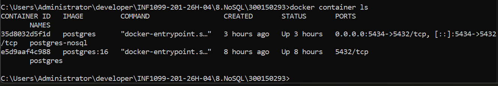
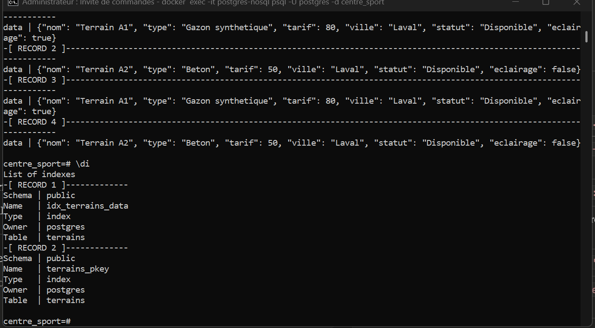
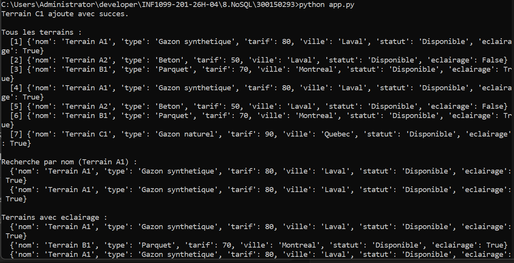

# 🗄️ TP NoSQL — PostgreSQL JSONB + Python
## Mini base NoSQL avec PostgreSQL, Docker et Python
## Centre Sportif — Gestion de Terrains & Réservations


---

## 🎯 Objectifs

| # | Objectif |
|---|----------|
| 1 | Déployer PostgreSQL avec Docker |
| 2 | Utiliser JSONB comme stockage NoSQL |
| 3 | Connecter Python à PostgreSQL via psycopg2 |
| 4 | Effectuer des opérations CRUD sur des données JSON |

---

## 📁 Structure du projet

```
300150293/
├── README.md
├── images/
├── init.sql          ← Création table + données initiales
├── app.py            ← Script Python CRUD
└── requirements.txt  ← Dépendances Python
```

---

## 🗂️ Opérateurs JSONB utilisés

| Opérateur | Rôle | Exemple |
|-----------|------|---------|
| `->>` | Accède à un champ texte | `data->>'nom' = 'Terrain A1'` |
| `->` | Accède à un champ JSON | `data->'eclairage'` |
| `?` | Vérifie si une clé existe | `data ? 'eclairage'` |
| `\|\|` | Fusionne deux objets JSON (UPDATE) | `data \|\| '{"tarif": 55}'::jsonb` |

---

## 🐳 Partie 1 — Docker

### Étape 1 : Lancer PostgreSQL

**Windows (CMD) :**

```cmd
docker run --name postgres-nosql -e POSTGRES_USER=postgres -e POSTGRES_PASSWORD=postgres -e POSTGRES_DB=centre_sport -p 5434:5432 -d postgres
```

### Étape 2 : Charger init.sql manuellement

```cmd
docker exec -i postgres-nosql psql -U postgres -d centre_sport < init.sql
```

### Étape 3 : Vérifier le conteneur

```cmd
docker container ls
```

<details>
<summary>📋 Résultat attendu</summary>

```
CONTAINER ID   IMAGE      STATUS       PORTS                                          NAMES
35d8032d5f1d   postgres   Up 3 hours   0.0.0.0:5434->5432/tcp, [::]:5434->5432/tcp   postgres-nosql
```

</details>

<details>
<summary>🖼️ Capture d'écran</summary>



</details>

---

## 🟡 Partie 2 — SQL NoSQL

### Vérifier la table et l'index

Se connecter au conteneur :

```cmd
docker exec -it postgres-nosql psql -U postgres -d centre_sport
```

Vérifier la table :

```sql
\dt
SELECT id, data->>'nom' AS nom, data->>'type' AS type, data->>'ville' AS ville FROM terrains;
```

Vérifier l'index GIN :

```sql
\di
```

### Requêtes JSONB

```sql
-- Rechercher par nom
SELECT data FROM terrains WHERE data->>'nom' = 'Terrain A1';

-- Rechercher les terrains avec eclairage
SELECT data FROM terrains WHERE (data->>'eclairage')::boolean = true;

-- Rechercher par ville
SELECT data FROM terrains WHERE data->>'ville' = 'Laval';
```

<details>
<summary>🖼️ Capture d'écran</summary>



</details>

---

## 🔵 Partie 3 — Python

### Étape 4 : Installer les dépendances

```cmd
pip install -r requirements.txt
```

### Étape 5 : Lancer le script

```cmd
python app.py
```

Le script s'exécute dans l'ordre :

| Opération | Description |
|-----------|-------------|
| INSERT | Ajoute le terrain C1 (Gazon naturel, Quebec) |
| SELECT ALL | Affiche tous les terrains |
| RECHERCHER nom | Recherche Terrain A1 par nom |
| RECHERCHER eclairage | Recherche les terrains avec eclairage |
| RECHERCHER ville | Recherche les terrains à Laval |
| UPDATE | Met à jour le tarif de Terrain A2 (50 → 55) |
| DELETE | Supprime Terrain B1 |

<details>
<summary>📋 Résultat attendu</summary>

```
Terrain C1 ajoute avec succes.

Tous les terrains :
  [1] {'nom': 'Terrain A1', 'type': 'Gazon synthetique', 'tarif': 80, ...}
  [2] {'nom': 'Terrain A2', 'type': 'Beton', 'tarif': 50, ...}
  [3] {'nom': 'Terrain B1', 'type': 'Parquet', 'tarif': 70, ...}
  [7] {'nom': 'Terrain C1', 'type': 'Gazon naturel', 'tarif': 90, ...}

Recherche par nom (Terrain A1) :
  {'nom': 'Terrain A1', 'type': 'Gazon synthetique', 'tarif': 80, ...}

Terrains avec eclairage :
  {'nom': 'Terrain A1', ...}
  {'nom': 'Terrain B1', ...}
  {'nom': 'Terrain C1', ...}

Terrains a Laval :
  {'nom': 'Terrain A1', ...}
  {'nom': 'Terrain A2', ...}

Mise a jour tarif de Terrain A2 (50 -> 55) :
  {'nom': 'Terrain A2', 'tarif': 55, ...}

Suppression de Terrain B1 :
  Terrain B1 supprime.

Etat final de la table :
  [1] {'nom': 'Terrain A1', ...}
  [2] {'nom': 'Terrain A2', 'tarif': 55, ...}
  [7] {'nom': 'Terrain C1', ...}

Connexion fermee.
```

</details>

<details>
<summary>🖼️ Capture d'écran</summary>



</details>

---

## 🟣 Bonus

| Prime | Implémenté dans `app.py` |
|-------|--------------------------|
| Suppression d'un terrain | `DELETE WHERE data->>'nom' = 'Terrain B1'` |
| Mettre à jour le JSON | `data \|\| '{"tarif": 55}'::jsonb` |
| Opérateurs `->` et `->>` | Utilisés dans toutes les requêtes filtrées |
| Recherche par ville | `data->>'ville' = 'Laval'` |
| Recherche par éclairage | `(data->>'eclairage')::boolean = true` |
