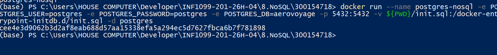
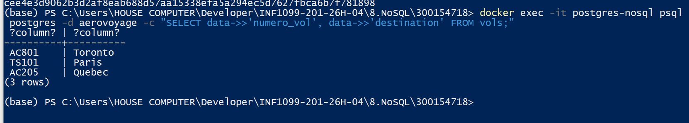
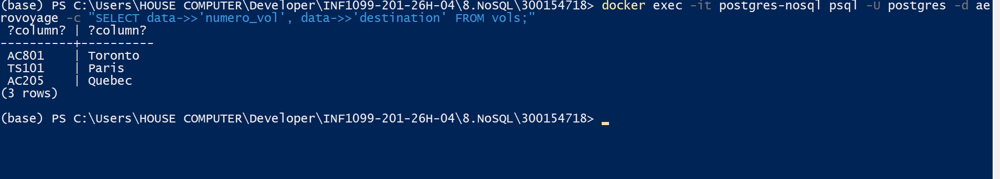
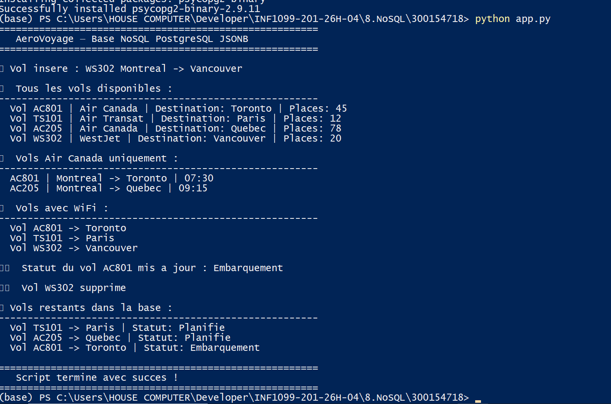

# ✈️ AeroVoyage — TP NoSQL · PostgreSQL JSONB


> **Cours :** INF1099-201-26H-04 · **Domaine :** AeroVoyage (Compagnie Aérienne)  
> **Stack :** Docker · PostgreSQL · Python · JSONB

---

## 🎯 Objectif

Construire une mini base **NoSQL** en utilisant **PostgreSQL avec le type JSONB**, dans un conteneur **Docker**, et l'interroger via un script **Python**.

---

## 📁 Structure du projet

```
300154718/
├── 🖼️  images/
│   ├── 1_conteneur.png
│   ├── 2_donnees.png
│   ├── 3_verification.png
│   └── 4_script_python.png
├── 📄 init.sql          ← Création table + données JSONB
├── 🐍 app.py            ← Script Python (CRUD complet)
├── 📦 requirements.txt  ← Dépendances Python
└── 📝 README.md
```



---

## 🛠️ Environnement technique

| Composant | Version |
|:---------:|:-------:|
| 🖥️ OS | Windows 11 |
| 🐳 Conteneur | Docker |
| 🗄️ Base | PostgreSQL 15 |
| 🐍 Langage | Python 3.x |
| 📦 Librairie | psycopg2-binary |

---

## 🚀 Étapes réalisées

### 1️⃣ Lancement du conteneur PostgreSQL

```powershell
docker run --name postgres-nosql `
  -e POSTGRES_USER=postgres `
  -e POSTGRES_PASSWORD=postgres `
  -e POSTGRES_DB=aerovoyage `
  -p 5432:5432 `
  -v ${PWD}/init.sql:/docker-entrypoint-initdb.d/init.sql `
  -d postgres
```


---

### 2️⃣ Initialisation — `init.sql`

- ✅ Création de la table `vols` avec colonne `data JSONB`
- ✅ Ajout d'un index **GIN** pour optimiser les requêtes JSONB
- ✅ Insertion de 3 vols en format JSON

```sql
CREATE TABLE vols (
    id   SERIAL PRIMARY KEY,
    data JSONB NOT NULL
);

CREATE INDEX idx_vols_data ON vols USING GIN (data);
```



---

### 3️⃣ Vérification des données

```powershell
docker exec -it postgres-nosql psql -U postgres -d aerovoyage `
  -c "SELECT data->>'numero_vol', data->>'destination' FROM vols;"
```



---

### 4️⃣ Script Python — `app.py`

| Opération | Description |
|:---------:|-------------|
| ➕ INSERT | Ajout d'un vol en JSON |
| 📋 SELECT ALL | Affichage de tous les vols |
| 🔎 SELECT filtré | Recherche par compagnie (`->>`) |
| 📡 SELECT filtré | Recherche par équipement (`@>`) |
| ✏️ UPDATE | Modification du statut (`\|\|`) |
| 🗑️ DELETE | Suppression d'un vol |

```powershell
pip install -r requirements.txt
python app.py
```



---

## 🧪 Requêtes JSONB utilisées

```sql
-- 🔍 Recherche par compagnie
SELECT data FROM vols
WHERE data->>'compagnie' = 'Air Canada';

-- 📡 Recherche par équipement (tableau JSON)
SELECT data FROM vols
WHERE data->'equipement' @> '["WiFi"]'::jsonb;

-- ✏️ Mise à jour partielle d'un champ JSON
UPDATE vols
SET data = data || '{"statut": "Embarquement"}'::jsonb
WHERE data->>'numero_vol' = 'AC801';

-- 🗑️ Suppression d'un vol
DELETE FROM vols
WHERE data->>'numero_vol' = 'WS302';
```

---

## 🔑 Opérateurs JSONB utilisés

| Opérateur | Description |
|:---------:|-------------|
| `->` | Accès à un champ JSON (retourne du JSON) |
| `->>` | Accès à un champ JSON (retourne du texte) |
| `@>` | Vérifie si un tableau JSON contient une valeur |
| `\|\|` | Fusionne deux objets JSON (utilisé pour UPDATE) |

---

## ✅ Résultat final

| Élément | Statut |
|---------|:------:|
| Conteneur PostgreSQL lancé | ✅ |
| Table `vols` créée avec JSONB | ✅ |
| Index GIN présent | ✅ |
| Données JSON insérées | ✅ |
| Script Python fonctionnel | ✅ |
| INSERT / SELECT / UPDATE / DELETE | ✅ |

---

## 💡 Conclusion

Ce TP démontre comment exploiter **PostgreSQL comme une base NoSQL** grâce au type JSONB, tout en gérant un environnement conteneurisé avec Docker et en automatisant les opérations via Python.

> 👉 Le domaine AeroVoyage permet d'illustrer des cas réels : gestion flexible de vols avec des attributs variables selon la compagnie, la classe et l'équipement disponible.

---

*Cours INF1099 — Bases de données · AeroVoyage*
