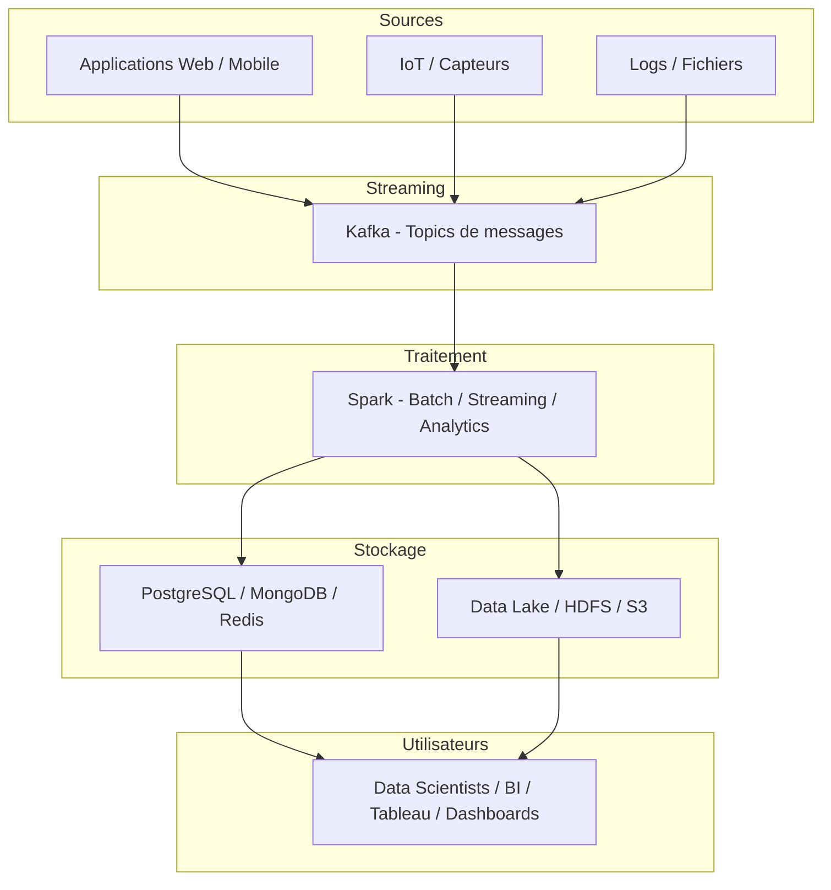

```mermaid
flowchart TD
    subgraph Sources
        A[Applications Web / Mobile]
        B[IoT / Capteurs]
        C[Logs / Fichiers]
    end

    subgraph Streaming
        D[Kafka - Topics de messages]
    end

    subgraph Traitement
        E[Spark - Batch / Streaming / Analytics]
    end

    subgraph Stockage
        F[PostgreSQL / MongoDB / Redis]
        G[Data Lake / HDFS / S3]
    end

    subgraph Utilisateurs
        H[Data Scientists / BI / Tableau / Dashboards]
    end

    A --> D
    B --> D
    C --> D

    D --> E
    E --> F
    E --> G
    F --> H
    G --> H
```
